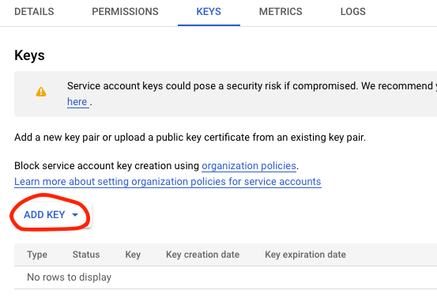

# Google Cloud
## 1. Sing up to Google Cloud
The Cloud provider used for this project will be Google Cloud.

https://console.cloud.google.com/getting-started

## 2. Install Google Cloud CLI
Follow the installation guide to install the CLI
https://cloud.google.com/sdk/docs/install

The CLI commands are [here](https://cloud.google.com/sdk/docs/cheatsheet).

## 3. Setup project

### Set up ADC (Application Default Credentials)
You need to set-up ADC for the environment you are going to use. To use your own account:
```properties
gcloud auth application-default login
```
Export the variable to the environment once you have logged in (The following path is the default for UNIX):
```bash
export GOOGLE_APPLICATION_CREDENTIALS="$HOME/.config/gcloud/application_default_credentials.json"
```
On this tutorial we will use a service account.

To create a service account, you have to got to:


In there, we create a new service account with **Storage Admin** + **Storage Object Admin** + **BigQuery Admin** permissions.

We generate a key for that account by clicking the 3 dots and adding a key.



Once it downloads, you can export it the same as your personal account and log in using that account.
```properties
export GOOGLE_APPLICATION_CREDENTIALS="<path/to/your/service-account-authkeys>.json"

gcloud auth activate-service-account --key-file "<path/to/your/service-account-authkeys>.json"
```
You should now see the account if you do:
```properties
gcloud auth list
```
and can now activate that account with:
```properties
gcloud config set account <accountemailaddress>
```

For more info you can check the [Tutorial](https://www.youtube.com/watch?v=UhYqag7Xjhw).

Enable these APIs for your project (by clicking on the links):

https://console.cloud.google.com/apis/library/iam.googleapis.com
https://console.cloud.google.com/apis/library/iamcredentials.googleapis.com
https://console.cloud.google.com/apis/library/bigquery.googleapis.com


Once we do that we can install python client libraries. e.g.:
```properties
poetry add google-cloud-storage
```
or 
```properties
pip install --upgrade google-cloud-storage
```
