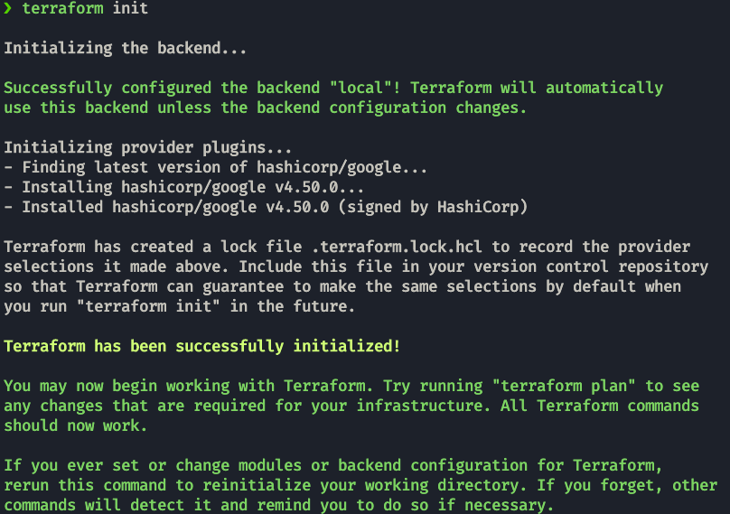
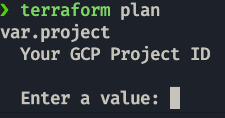
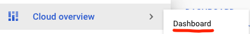
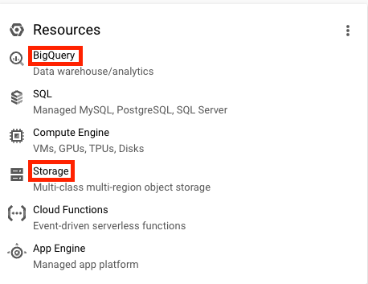

# Terraform
## 1. Install Terraform
Terraform is an open-source **infrastructure as code** software tool. It will be used to generate the GCP infrastructure.
```shell
brew tap hashicorp/tap
brew install hashicorp/tap/terraform
```
### Other options
https://developer.hashicorp.com/terraform/downloads

### Terraform GCP get started guide
https://developer.hashicorp.com/terraform/tutorials/gcp-get-started

## 2. Code your infrastructure with Terraform

### main.tf
This file contains these 4 basic declarations:
* `terraform`: configure basic Terraform settings to provision your infrastructure
   * `required_version`: minimum Terraform version to apply to your configuration
   * `backend`: stores Terraform's "state" snapshots, to map real-world resources to your configuration.
      * `local`: stores state file locally as `terraform.tfstate`
   * `required_providers`: specifies the providers required by the current module
* `provider`:
   * adds a set of resource types and/or data sources that Terraform can manage
   * The Terraform Registry is the main directory of publicly available providers from most major infrastructure platforms.
* `resource`
  * Physical component and its attributes.
  * blocks to define components of your infrastructure
  * Project modules/resources: google_storage_bucket, google_bigquery_dataset, google_bigquery_table

!!! note
    The resources change name with the different providers; in this case the required_providers source is `hashicorp/google` so we get `google_storage_bucket`for example. If it was `aws` we would have to use the `s3` version of the package.

### variables.tf

* `variable` & `locals` are runtime arguments and constants

They are used in the `main.tf` like so:

variables.tf
```terraform
variable "project" {
  description = "Your GCP Project ID"
}

variable "region" {
  description = "Region for GCP resources. Choose as per your location: https://cloud.google.com/about/locations"
  default = "europe-west6"
  type = string
}
```
main.tf:
```terraform
provider "google" {
  project = var.project
  region = var.region
}
```
## 3. Generate your infrastructure via Terraform
Terraform has few associated commands  that we need to use:
### Initialize state file (.tfstate)
```properties
terraform init
```

### Check changes to new infra plan
This command matches changes against the previous state.
```properties
terraform plan -var="project=<your-gcp-project-id>"
```
If you dont add the `-var` argument, You will get a promt like this one:\


### Create new infra
This command applies changes to the cloud.
```properties
terraform apply -var="project=<your-gcp-project-id>"
```
After a correct application, you can go to the management platform and see your newly created resources:





### Delete infra after your work, to avoid costs on any running services
```properties
terraform destroy
```