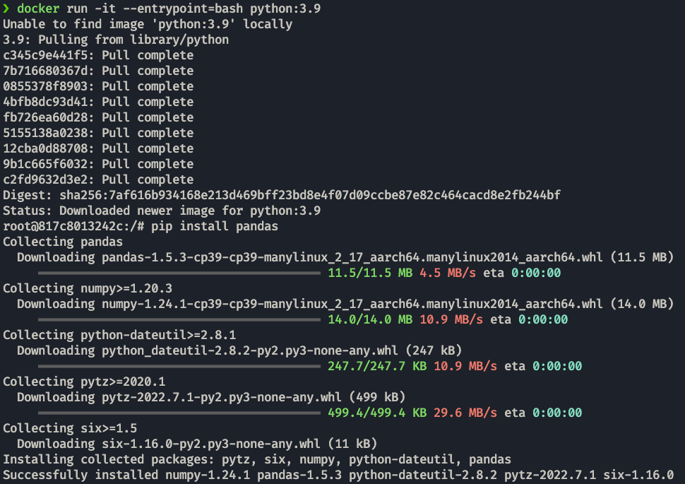

# Docker

The course's page is [here](https://github.com/DataTalksClub/data-engineering-zoomcamp/tree/main/week_1_basics_n_setup/2_docker_sql).

We use docker to create the containers that will have the components for our application inside.


## Installation and basic commands

First we install docker for our platform: https://docs.docker.com/get-docker/

You can test the installation by running:

```properties
docker run hello-world
```
Which will print the following:


> **_NOTE:_** If you get "`Cannot connect to the Docker daemon at unix:///var/run/docker.sock. Is the docker daemon running?.`" as an error, you need to start the daemon, on mac it is done by running the docker app. 

If we run the command shown in the `hello-world` image:
```properties
docker run -it ubuntu bash
```
We will get a container with ubuntu on it, in which we can run normal bash commands.


> **_NOTE:_** `-it` -> _interactive_ + _terminal_. When you docker run with this command it takes you straight inside the container.\
> Other common flag is `-d` -> _detach_, wich will keep the terminal free and the machine running in the background.

With `docker ps` or `docker container ls` we can check the containers currently running.


We can specify the tag(specific version) of a container that we want to use.
```
docker run -it python:3.9
```
This image will run an interactive python shell, but we will not be able to use the shell to install packages from there. 

We can specify an entrypoint to the container, for example, bash.

```properties
docker run -it --entrypoint=bash python:3.9
```
We will now be in a shell able to install packages like `numpy` on our container.



> **_NOTE:_** Remember that packages installed will not be mantained between different runs of the container, they will mantain the structure they had when downloaded.

## Dockerfiles
In these files we can specify instructions in order to run the containers. 

These are usually called just `Dockerfile` but you can specify names like `dev.Dockerfile`, `prod.Dockerfile` ... etc

```Dockerfile
# This needs to be the first line
# and specifies the base image.
FROM python:3.9

# We can run shell commands.
RUN pip install pandas

# We can specify the entrypoint 
# in here instead of in the CLI.
ENTRYPOINT [ "bash" ]
```

Now we can build an image based on `python:3.9` that also uses performs these instructions.

```properties
docker build -t test:pandas ./week1/docker/test
```
We specify the `name:tag` of the container with `-t` and after that the path where we will take the config for the image (This folder is the one to contain the Dockerfile)


We can also copy files from our system to the image adding:

```Dockerfile
# We first select the working directory
WORKDIR /app
# We copy the file with the structure:
# COPY file_in_system file_in_image
COPY pipeline.py pipeline.py
```

we can run this image by using:
```properties
docker run -it test:pandas
```


We can also specify that we want to execute the file on startup by changing the entrypoint:
```Dockerfile
ENTRYPOINT [ "python", "pipeline.py"]
```

Another option is to add parameters to the script:
```python
import sys

import pandas as pd

print(sys.argv)

day = sys.argv[1]

# some fancy stuff with pandas

print(f'job finished successfully for day = {day}')
```
And we can run it with:
```properties
docker run -it test:pandas 20-02-2003
```

