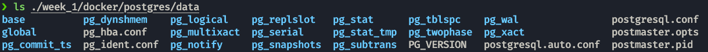
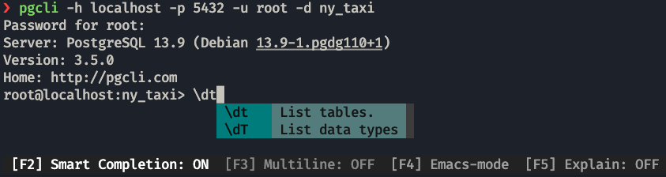

# Postgres
To use postgres we are going to run an docker image that already contains it.

* We will use the `-e` tag to add environmental variables.
* The `-v` tag will map a folder in our host into a folder in the container; any modifications in one will happen on the other. **THIS FOLDER NEEDS TO BE EMPTY.**
* THe `-p` tag will map a port from the host to the container.

```bash
docker run -it \
  -e POSTGRES_USER="root" \
  -e POSTGRES_PASSWORD="root" \
  -e POSTGRES_DB="ny_taxi" \
  -v $(pwd)/code/week_1/docker/postgres/data:/var/lib/postgresql/data \
  -p 5432:5432 \
  postgres:13
```

> In this case, if you receive an error like `initdb: error: directory "/var/lib/postgresql/data" exists but is not empty.
If you want to create a new database system, either remove or empty the directory "/var/lib/postgresql/data" or run initdb with an argument other than "/var/lib/postgresql/data".`
The host folder you are providing is not empty.

This will create the folder structure needed for postgres.


To interface with the image we use `pgcli`, a python package that we will add to poetry.
```properties
poetry add "psycopg2-binary"
poetry add pgcli
```
Using the following command we can interface with the database:
```properties
pgcli -h localhost -p 5432 -u root -d ny_taxi
```
This allows us to use commands on the container.


We will add jupyter and other packages to our environment to explore the data.
```properties
poetry add jupyter pandas sqlalchemy
```

Now we will download the dataset, which is the [NY taxi dataset](https://www.nyc.gov/site/tlc/about/tlc-trip-record-data.page), which is a common one for experimenting with data tools. The one used is [this one](https://d37ci6vzurychx.cloudfront.net/trip-data/yellow_tripdata_2022-01.parquet).

```properties
curl -O -L --output-dir ./src/dtc_de_course/week_1/docker/postgres/raw https://d37ci6vzurychx.cloudfront.net/trip-data/yellow_tripdata_2022-01.parquet
```
or
```properties
wget -p ./src/dtc_de_course/week_1/docker/postgres/raw https://d37ci6vzurychx.cloudfront.net/trip-data/yellow_tripdata_2022-01.parquet
```

We load this data into Postgres with the code inside [this notebook](https://github.com/Tonivalle/DTC-DE-Course/blob/main/code/week_1/docker/postgres/data_to_postgres.ipynb).

To see the data and interact with it we are going to use pgAdmin inside a docker container, wich we will be able to see in our browser at `http://localhost:8080/`.

```properties
docker run -it \
  -e PGADMIN_DEFAULT_EMAIL="admin@admin.com" \
  -e PGADMIN_DEFAULT_PASSWORD="root" \
  -p 8080:80 \
  dpage/pgadmin4
```