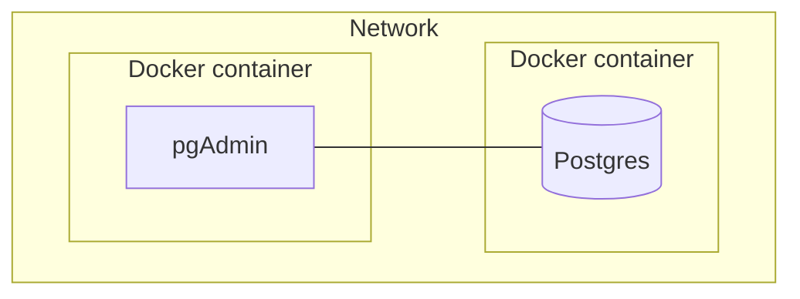
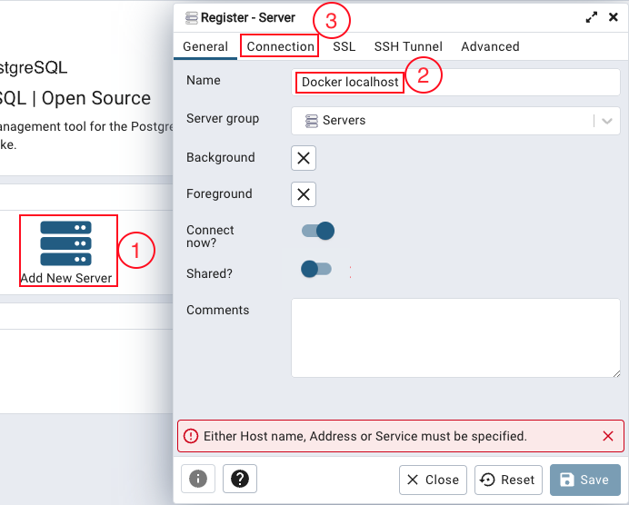
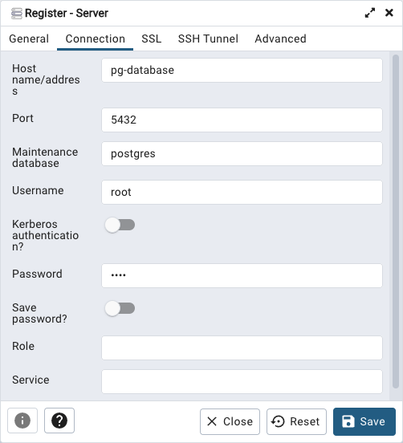

# Networks
Right now the database and pgAdmin will not be able to see each other, we need to put them inside a common network. 


The code to create a network called `pg-network` is:

```properties
docker network create pg-network
```
and adding the network as environmental variable to the other two containers:

```properties hl_lines="7 8 15"
docker run -it \
  -e POSTGRES_USER="root" \
  -e POSTGRES_PASSWORD="root" \
  -e POSTGRES_DB="ny_taxi" \
  -v $(pwd)/week_1/docker/postgres/data:/var/lib/postgresql/data \
  -p 5432:5432 \
  --name pg-database \
  --network=pg-network \
  postgres:13

docker run -it \
  -e PGADMIN_DEFAULT_EMAIL="admin@admin.com" \
  -e PGADMIN_DEFAULT_PASSWORD="root" \
  -p 8080:80 \
  --network=pg-network \
  dpage/pgadmin4
```
> **_NOTE:_** We gave the database a `--name` to configure the connection easier, since if you dont you need to check the name docker has given the container.

We can now go to `localhost:8080` since in the pgadmin configuration we passed that as the port in our machine that will comunicate with the container.

We will need to login with the credentials `admin@admin.com` and `root` which we gave pgadmin as env variables.

Now clicking in `Add New Server`will show us the prompt to pass the database info, add a name and go to `Connection`.



Fill out the connection information with your containers data.


On the browser to the left we can check the data. Go to `Servers > Docker localhost > Databases > ny_taxi > Schemas > Tables` right click on it and select `First 100 Rows`.

You can also use SQL code via the `Query Tool`, accessible on the tools menu or clicking on this symbol: 

