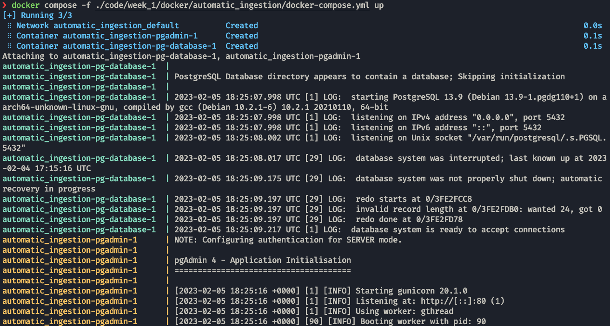

# Docker-Compose
This is a tool for defining and running multi-container Docker applications, With it, we can start the whole application using only one file.

We can specify every parameter of the containers in a file called `docker-compose.yaml`:

!!! info inline end
    * Note that we dont need to specify the network, `docker-compose` automatically puts every service inside the same network.
    * The volumes have a `:rw` at the end to give read and write permissions to the container in those volumes.


```yaml
services:
  pg-database:
    image: postgres:13
    environment:
      - POSTGRES_USER=root
      - POSTGRES_PASSWORD=root
      - POSTGRES_DB=ny_taxi
    volumes:
      - ../postgres/data:/var/lib/postgresql/data:rw
    ports:
      - "5432:5432"

  pgadmin:
    image: dpage/pgadmin4
    environment:
      - PGADMIN_DEFAULT_EMAIL=admin@admin.com
      - PGADMIN_DEFAULT_PASSWORD=root
    ports:
      - "8080:80"
```

Now we can call `docker-compose` to spin up all these services:
```properties
docker-compose -f ./code/week_1/docker/automatic_ingestion/docker-compose.yml up
```



!!! tip
    You only need the `-f` flag if your `docker-compose.yaml` is not no your current directory.

    You can start the services normally with:
    ```properties
    docker-compose up 
    ```
    Also you can run them in __detached mode__ if you use the `-d` flag.