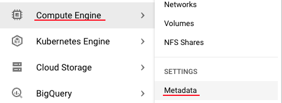
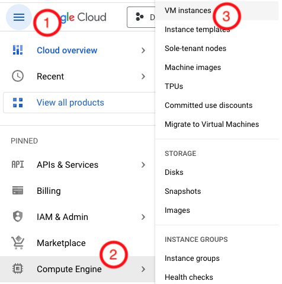
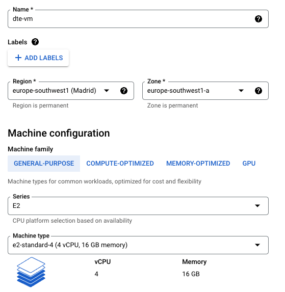
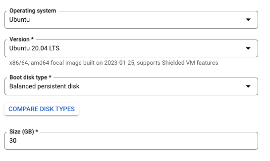
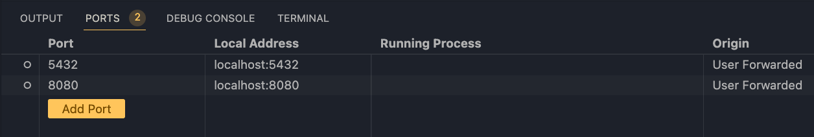

# Setting up the Environment on Google Cloud (Cloud VM + SSH access)

We will need a **VM instance** in Google Cloud that contains everything we need for the project. 

## Create a VM Instance
First we generate an ssh key to connect following [the documentation](https://cloud.google.com/compute/docs/connect/create-ssh-keys).

The command for MacOS is:
```properties
ssh-keygen -t rsa -f ~/.ssh/gcp -C tonivalle -b 2048
```
This will generate two ssh keys, one public and on private, inside `~/.ssh`. Fore more info on ssh keys, click [here](#info-on-shh-keys).

Go to `Menu Bar > Compute Engine > Metadata`:



!!! info
    You may need to enable the Compute Engine API (`Menu Bar > Compute Engine`) to be allowed to add the ssh key and otherwise use this functionality.

In the `ssh keys` tab you will need to add your **public key**. All the VM instances you create will inherit these keys.
To see the ssh key you can use 
```properties
cat ~/.ssh/gcp.pub
```

Go to `Menu Bar > Compute Engine > VM Instances`:



You can click on `Create Instance`and add the configuration depending on your location:


!!! danger
    We are using a machine of type `e2-standard-4 (4 vCPU, 16 GB memory)` which costs $0.16 per hour. It is important to shut down the VM when we are not working to not pay more than it is needed.

On boot disk we will use Ubuntu 20.04 with 30 GB of memory


Now we can connect to the VM via:
```properties
ssh -i ~/.ssh/gcp <Username inside your key>@<Public IP of your VM>
```

Another way to connect is to use a ssh config file:

=== "Create the ssh config"
    ```properties
    touch  ~/.ssh/config
    code  ~/.ssh/config
    ```


=== "Fill the config info"
    ```properties
    Host <Name of your VM>
    HostName <Public IP of your VM>
    User <Username inside your key>
    IdentityFile ~/.ssh/gcp
    ```
=== "Connect to the VM"
    ```properties
    ssh <Name of your VM>
    ```

## Work with the VM inside VSCode
To allow editing files via _ssh_ we can install the VSCode `Remote - SSH` Extension. Now, if we click on this button on the bottom left:

 

We can use _ssh_ inside VSCode.

On the VM we will use:

## Configure the Environment
```properties
sudo apt update
sudo apt install python3 python3-dev python3-venv
sudo apt-get install wget
wget https://bootstrap.pypa.io/get-pip.py
sudo python3 get-pip.py
sudo apt-get install docker.io
```

We can use docker without having to type _sudo_ every time if we run these commands (You will need to log out of ssh and back in for the membership to aply):
```properties
sudo groupadd docker
sudo gpasswd -a $USER docker
sudo service docker restart
```
### Pyenv
To configure pyenv (not needed but always a good idea) we can do:
```properties
curl https://pyenv.run | bash

sudo apt update; sudo apt install build-essential libssl-dev zlib1g-dev \
libbz2-dev libreadline-dev libsqlite3-dev curl \
libncursesw5-dev xz-utils tk-dev libxml2-dev libxmlsec1-dev libffi-dev liblzma-dev
```
And add this to our _.bashrc_ and restart the shell:
```bash
export PYENV_ROOT="$HOME/.pyenv"
command -v pyenv >/dev/null || export PATH="$PYENV_ROOT/bin:$PATH"
eval "$(pyenv init -)"
```
Execute now:
```properties
pyenv install 3.9.5
pyenv global 3.9.5
```
### Poetry
We can install the package's dependencies via poetry like in our local machine:
```properties
pip install poetry
poetry install
poetry shell
```

### Docker-compose 
We need to add docker-compose to the VM. We can do that bu running:
```properties
mkdir bin
cd bin
wget https://github.com/docker/compose/releases/download/v2.15.1/docker-compose-linux-x86_64 -O docker-compose # Change de direction to the latest release of docker-compose for your architecture.
chmod +x docker-compose
```
Now we add it to the .bashrc
```bash
export PATH="${HOME}/bin:${PATH}"
```

To execute the docker-compose we clone the repo inside our VM and execute it:
```properties
docker-compose -f ./src/dtc_de_course/week_1/docker/automatic_ingestion/docker-compose.yml -d up
```

### Port Forwarding
This technique allows us to connect ports in our VM to our local computer.

It can be done via this command depending on the direction:

=== "If your connection is already established"
    ```properties
    # Type in the console
    ~C
    -R 8080:localhost:80
    -L 17125:localhost:12125
    ```
=== "Remote port to localhost"

    ```properties
    # Establish connections with the ports already forwarded
    ssh -R [REMOTE:]REMOTE_PORT:DESTINATION:DESTINATION_PORT [USER@]SSH_SERVER
    # Example
    ssh -R 8080:localhost:80 public.example.com
    ```

=== "Local port to remote"

    ```properties
    # Establish connections with the ports already forwarded
    ssh -L [LOCAL_IP:]LOCAL_PORT:DESTINATION:DESTINATION_PORT [USER@]SSH_SERVER
    # Example
    ssh -L 3336:db001.host:3306 user@pub001.host
    ```
Alternatively, you can use VSCode to manage it for you:



With this configuration, we can access the database on the VM in our local command line without having to connect via _ssh_.
```properties
pgcli -h 127.0.0.1 -p 5432 -U root -d ny_taxi
```
!!! note
    Notice we changed the host (`-h`) from __localhost__ to __127.0.0.1__

Connecting to `http://localhost:8080/` lets us see __pgAdmin__ like if it was running on our machine.

If we also forward port `8888` we can see jupyter notebooks started on our VM in our local browser (You may need to copy the url in the VM's console since it includes the __token__).

### Ingesting the data

We can run the data ingestion pipeline by using:

```properties hl_lines="3"
docker build -t taxi_ingest:v0.0.1 ./src/dtc_de_course/week_1/docker/automatic_ingestion

docker run -it --network=automatic_ingestion_default taxi_ingest:v0.0.1 \
   --user=root \
   --password=root \
   --host=pg-database \
   --port=5432 \
   --db=ny_taxi \
   --table_name=yellow_taxi_trips \
   --url=https://d37ci6vzurychx.cloudfront.net/trip-data/yellow_tripdata_2022-01.parquet
```

!!! note
    As always, the network name needs to be the same as your other containers in the network.

### Adding terraform to the VM
We can add terraform to the VM:
```properties
wget -O- https://apt.releases.hashicorp.com/gpg | gpg --dearmor | sudo tee /usr/share/keyrings/hashicorp-archive-keyring.gpg
echo "deb [signed-by=/usr/share/keyrings/hashicorp-archive-keyring.gpg] https://apt.releases.hashicorp.com $(lsb_release -cs) main" | sudo tee /etc/apt/sources.list.d/hashicorp.list
sudo apt update && sudo apt install terraform
```
### Adding the service account to the VM
We created a service account in the __[first section](./1-google-cloud.md)__ of the week's folder.

To do this we can use __SFTP__ (Secure File Transfer Protocol) to do it. The json file for the service account was inside `$HOME/.config/gcloud/` in our case.

```properties
cd $HOME/.config/gcloud/

# This will open an sftp console
sftp dte-vm

mkdir .gc
cd .gc
put <Name of your key>.json
```
With this your key should be inside your VM.

We will need to set this google application credential since we cant _OAUTH_ from the VM.
```properties
export GOOGLE_APPLICATION_CREDENTIALS=~/.gc/<Name of your key>.json
gcloud auth activate-service-account --key-file $GOOGLE_APPLICATION_CREDENTIALS
```
### Using terraform on the VM
We can do the same in here as we did on our local machine. We will need to init, plan and

```properties
terraform -chdir=./src/dtc_de_course/week_1/terraform init
terraform -chdir=./src/dtc_de_course/week_1/terraform plan -var="project=vast-bounty-142716" # This is your project id
```

### Stop the VM
You can stop the VM via the UI for GCP or using 
```properties
sudo shutdown
```
!!! tip
    Whenever you restart the machine you will need to pass the new IP given to your VM to your ~/.ssh/config.


## Info on shh keys

via [ssh.com](https://www.ssh.com/academy/ssh/public-key-authentication#:~:text=Private%20key%20stays%20with%20the,have%20the%20corresponding%20private%20key.).

The following simple steps are required to set up public key authentication (for SSH):

1. Private key stays with the user (and only there), while the public key is sent to the server. Typically with the ssh-copy-id utility.
2. Server stores the public key (and "marks" it as authorized).
3. Server will now allow access to anyone who can prove they have the corresponding private key. 