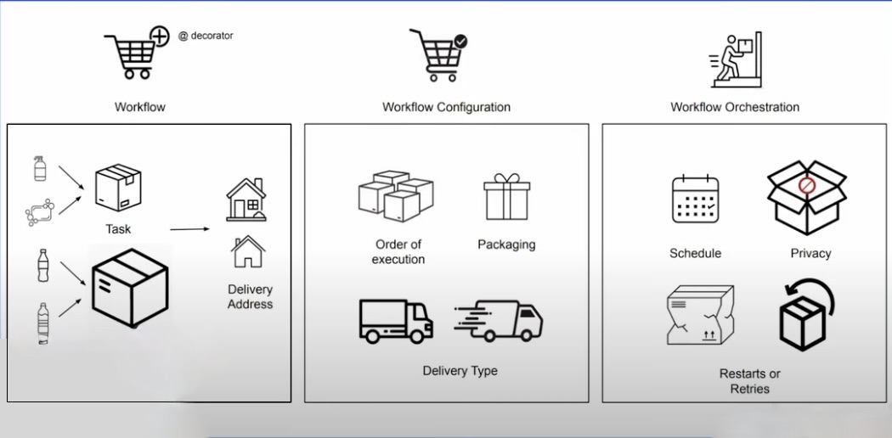
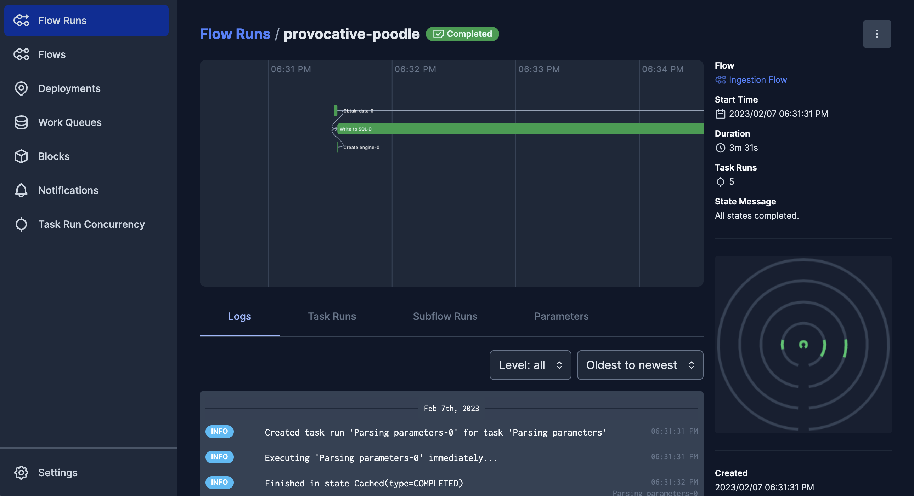
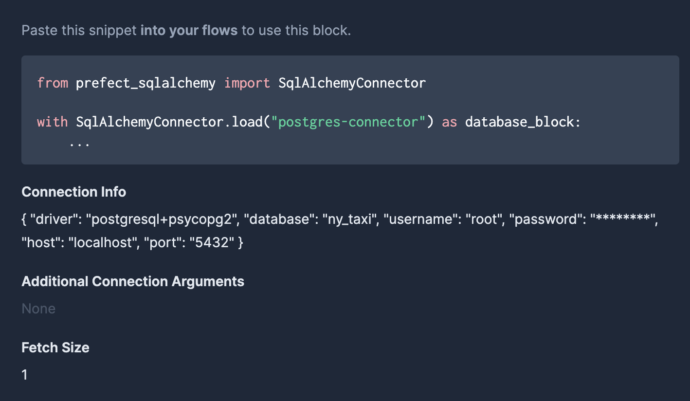

# Workflow Orchestration

## What is Workflow Orchestration

Workflow orchestration means governing your dataflow in a way that respects the orchestration rules and your business logic. A Workflow Orchestration tool allows you to turn any code into a workflow that you can schedule, run, and observe.

Some Workflow Orchestration tools are __Apache Airflow__ and __Prefect__, which we will use in the course.

??? example 
    
    Imagine that the workflow orchestration tool is your personal delivery service:

    * Each __order__ (or shopping cart) reflects your __workflow__, it’s extremely easy and convenient to put things into a shopping cart — you just add a couple of decorators, and you’re off to the races.
    * Within each order (or shopping cart), you may have many products that get packaged into __boxes__ — your __tasks__.
    * Each delivery is a __workflow run__.
    
    * Products within the boxes may have various __flavors, forms, and shapes__, and they reflect what you put into your shopping cart — __what__ you wished to be orchestrated and __how__.
    * __Flavors__ may reflect your data replication jobs (e.g. Airbyte), data transformations (e.g. dbt), data cleaning (e.g. pandas), your ML use cases (e.g. scikit-learn), and so much more.
    * Your __boxes__ (tasks) may be as small or as big as you wish — it’s your order in the end (your workflow design).
    * __Products__ inside of your boxes may come from __various vendors__, i.e. your data tools, e.g. dbt, Fivetran, your favorite ML frameworks, your custom data cleaning libraries...
    * The __delivery address__ may either be your home address (your __data warehouse__), your holiday address (your __data lake__), or an address of a friend (some __external database__, __data processing service__, __microservice__, or __application__).

## Starting to use prefect

To start using __prefect__ we will need to install the libraries required to continue with the project:
```properties
poetry add prefect prefect-sqlalchemy "prefect-gcp[cloud_storage]" pandas-gbq greenlet
```
!!! warning 
    The `sqlalchemy` version may conflict with the requiered by `prefect`, you may need to uninstall it (It will be added lateras a dependency of `prefect-sqlalchemy`)

## Transforming our ingestion script to a Flow

A `flow` is the most basic __prefect__ object, it contains the _workflow_ logic and allows you to interact and understand the state of the _workflow. They act like functions: they accept inputs, perform work, return outputs...
You can turn any function into a Prefect flow by adding the `@flow` decorator.

`Flows` can call `tasks` or even other `flows` (called in this case `subflows`). A task is a function that represents a discrete unit of work in a Prefect workflow. They are not required, you can use a `flow` with functions, but you gain added functionalities like __timeout__, __retries__, __traceability__...

`Tasks` can also receive Metadata from upstream so you can set dependencies for tasks, like waiting for one task to en for another to begin, or not starting a task if another fails. They also allow _**Caching**_.

??? info
    Some useful parameters are:
    
    * __retries__
        * An optional number of times to retry on task run failure.
    * __cache_key_fn__ 
        * An optional callable (usually `task_input_hash`) that, given the task run context and call parameters, generates a string key; if the key matches a previous completed state, that state result will be restored instead of running the task again.
    * __cache_expiration__
        * An optional amount of time represented by a `timedelta` indicating how long cached states for this task should be restorable; if not provided, cached states will never expire.    
    * __log_prints__
        * If set to _True_, `print` statements in the task will be redirected to the Prefect logger for the task run. Defaults to None, which indicates that the value from the flow should be used.


??? example
    ```python

        import argparse
        import os
        from typing import Dict

        import pandas
        import pyarrow.parquet as parquet  # type: ignore
        from sqlalchemy import create_engine
        from sqlalchemy.engine import Engine

        from prefect import flow, task
        from prefect.tasks import task_input_hash
        from datetime import timedelta


        @flow(name="Ingestion Flow")
        def pipeline():

            params = _parse_params()

            df, data_file_route = _get_format_data(params)

            engine = _create_engine(params)

            _write_to_table(df, engine)
            _remove_raw_data_file(data_file_route)


        @task(name="Parsing parameters", cache_key_fn=task_input_hash, cache_expiration=timedelta(weeks=1))
        def _parse_params() -> Dict:
            parser = argparse.ArgumentParser(description="Ingest CSV data to Postgres")

            parser.add_argument("--user", required=True, help="user name for postgres")
            parser.add_argument("--password", required=True, help="password for postgres")
            parser.add_argument("--host", required=True, help="host for postgres")
            parser.add_argument("--port", required=True, help="port for postgres")
            parser.add_argument("--db", required=True, help="database name for postgres")
            parser.add_argument("--url", required=True, help="url of the csv file")
            parser.add_argument(
                "--table_name",
                required=True,
                help="name of the table where we will write the results to",
            )
            return vars(parser.parse_args())

        @task(name="Obtain data", retries=3, cache_key_fn=task_input_hash, cache_expiration=timedelta(weeks=1))
        def _get_format_data(params:Dict) -> pandas.DataFrame:
            data_file_route = _download_data(params)
            df = _generate_df(data_file_route)
            return df, data_file_route


        def _download_data(params: Dict) -> str:
            os.system(f"curl -O -L {params['url']}")
            file_name = params["url"].split("/")[-1]
            return f"./{file_name}"


        def _generate_df(data_file_route: str) -> pandas.DataFrame:
            data = parquet.read_table(data_file_route)
            return data.to_pandas()

        @task(name="Create engine")
        def _create_engine(params: Dict) -> Engine:
            return create_engine(
                f"postgresql://{params['user']}:{params['password']}@{params['host']}:{params['port']}/{params['db']}"
            )

        @task(name="Write to SQL")
        def _write_to_table(df: pandas.DataFrame, engine:Engine):
            df.to_sql(
                name="yellow_taxi_data", con=engine, if_exists="replace", chunksize=100_000
            )

        @task(name="Cleanup")
        def _remove_raw_data_file(data_file: str):
            os.remove(data_file)


        if __name__ == "__main__":
            pipeline()
    ```

## Open the Orion UI to manage Workflows

To start we will need to configure the API URL:
```properties
prefect config set PREFECT_API_URL=http://127.0.0.1:4200/api
```
And now we can start the service: 
```properties
prefect orion start
```

This will start the UI service in [`http://127.0.0.1:4200/api`](http://127.0.0.1:4200/api)


Here, on the left menu we can see `Blocks`, which securely store credentials and configuration to easily manage connections to external systems (like aws, gcp or kubernetes). We can set limits to concurrent tasks or get notifications.

## Adding a Block for SQLAlchemy

They can be installed using collections for different services (in this case, for sqlalchemy, is `prefect_sqlalchemy`).

On the UI, we will create a block of __SQLAlchemy Connector__ using a _Sync Driver_ and type _postgresql+psycopg2_. We can also add the other information like user, password... Ending with something like this:



We will use the class `SqlAlchemyConnector` to give the code access to the data contained in the block. This will allow us to reduce the number of input parameters of our script since they come from the Block. In the following Example you can see the difference highlighted:


=== "Not Using Blocks"
    ```python hl_lines="22 32 33 34 35 36 62 63 64 65 66"

        import argparse
        import os
        from typing import Dict

        import pandas
        import pyarrow.parquet as parquet  # type: ignore
        from sqlalchemy import create_engine
        from sqlalchemy.engine import Engine

        from prefect import flow, task
        from prefect.tasks import task_input_hash
        from datetime import timedelta


        @flow(name="Ingestion Flow")
        def pipeline():

            params = _parse_params()

            df, data_file_route = _get_format_data(params)

            engine = _create_engine(params)

            _write_to_table(df, engine)
            _remove_raw_data_file(data_file_route)


        @task(name="Parsing parameters", cache_key_fn=task_input_hash, cache_expiration=timedelta(weeks=1))
        def _parse_params() -> Dict:
            parser = argparse.ArgumentParser(description="Ingest CSV data to Postgres")

            parser.add_argument("--user", required=True, help="user name for postgres")
            parser.add_argument("--password", required=True, help="password for postgres")
            parser.add_argument("--host", required=True, help="host for postgres")
            parser.add_argument("--port", required=True, help="port for postgres")
            parser.add_argument("--db", required=True, help="database name for postgres")
            parser.add_argument("--url", required=True, help="url of the csv file")
            parser.add_argument(
                "--table_name",
                required=True,
                help="name of the table where we will write the results to",
            )
            return vars(parser.parse_args())

        @task(name="Obtain data", retries=3, cache_key_fn=task_input_hash, cache_expiration=timedelta(weeks=1))
        def _get_format_data(params:Dict) -> pandas.DataFrame:
            data_file_route = _download_data(params)
            df = _generate_df(data_file_route)
            return df, data_file_route


        def _download_data(params: Dict) -> str:
            os.system(f"curl -O -L {params['url']}")
            file_name = params["url"].split("/")[-1]
            return f"./{file_name}"


        def _generate_df(data_file_route: str) -> pandas.DataFrame:
            data = parquet.read_table(data_file_route)
            return data.to_pandas()

        @task(name="Create engine")
        def _create_engine(params: Dict) -> Engine:
            return create_engine(
                f"postgresql://{params['user']}:{params['password']}@{params['host']}:{params['port']}/{params['db']}"
            )

        @task(name="Write to SQL")
        def _write_to_table(df: pandas.DataFrame, engine:Engine):
            df.to_sql(
                name="yellow_taxi_data", con=engine, if_exists="replace", chunksize=100_000
            )

        @task(name="Cleanup")
        def _remove_raw_data_file(data_file: str):
            os.remove(data_file)


        if __name__ == "__main__":
            pipeline()
    ```

=== "Using Blocks"
    ```python hl_lines="12 66 67"
        import argparse
        import os
        from typing import Dict

        import pandas
        import pyarrow.parquet as parquet  # type: ignore
        from sqlalchemy import create_engine
        from sqlalchemy.engine import Engine

        from prefect import flow, task
        from prefect.tasks import task_input_hash
        from prefect_sqlalchemy import SqlAlchemyConnector
        from datetime import timedelta


        @flow(name="Ingestion Flow")
        def pipeline():

            params = _parse_params()

            df, data_file_route = _get_format_data(params)

            _write_to_table(df)

            _remove_raw_data_file(data_file_route)


        @task(name="Parsing parameters", cache_key_fn=task_input_hash, cache_expiration=timedelta(weeks=1))
        def _parse_params() -> Dict:

            parser = argparse.ArgumentParser(description="Ingest CSV data to Postgres")

            parser.add_argument("--url", required=True, help="url of the csv file")
            parser.add_argument(
                "--table_name",
                required=True,
                help="name of the table where we will write the results to",
            )
            return vars(parser.parse_args())

        @task(name="Obtain data", retries=3, cache_key_fn=task_input_hash, cache_expiration=timedelta(weeks=1))
        def _get_format_data(params:Dict) -> pandas.DataFrame:
            data_file_route = _download_data(params)
            df = _generate_df(data_file_route)
            return df, data_file_route


        def _download_data(params: Dict) -> str:
            os.system(f"curl -O -L {params['url']}")
            file_name = params["url"].split("/")[-1]
            return f"./{file_name}"


        def _generate_df(data_file_route: str) -> pandas.DataFrame:
            data = parquet.read_table(data_file_route)
            return data.to_pandas()

        @task(name="Create engine")
        def _create_engine(params: Dict) -> Engine:
            return create_engine(
                f"postgresql://{params['user']}:{params['password']}@{params['host']}:{params['port']}/{params['db']}"
            )

        @task(name="Write to SQL")
        def _write_to_table(df: pandas.DataFrame):
            connection_block = SqlAlchemyConnector.load("postgres-connector")
            with connection_block.get_connection(begin=False) as engine:
                df.to_sql(
                    name="yellow_taxi_data", con=engine, if_exists="replace", chunksize=100_000
                )

        @task(name="Cleanup")
        def _remove_raw_data_file(data_file: str):
            os.remove(data_file)


        if __name__ == "__main__":
            pipeline()
    ```

And the call from the command line:
=== "Not Using Blocks"
    ```properties
    python ./src/dtc_de_course/week_2/start/data_ingest.py   --user=root \
    --password=root \
    --host=localhost \
    --port=5432 \
    --db=ny_taxi \
    --table_name=yellow_taxi_trips \
    --url=https://d37ci6vzurychx.cloudfront.net/trip-data/yellow_tripdata_2022-01.parquet
    ```
=== "Using Blocks"
    ```properties
    python ./src/dtc_de_course/week_2/start/data_ingest.py \
    --table_name=yellow_taxi_trips \
    --url=https://d37ci6vzurychx.cloudfront.net/trip-data/yellow_tripdata_2022-01.parquet
    ```