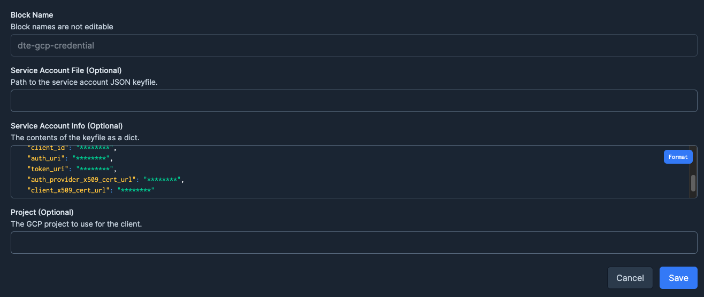
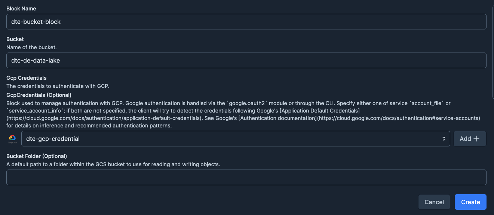
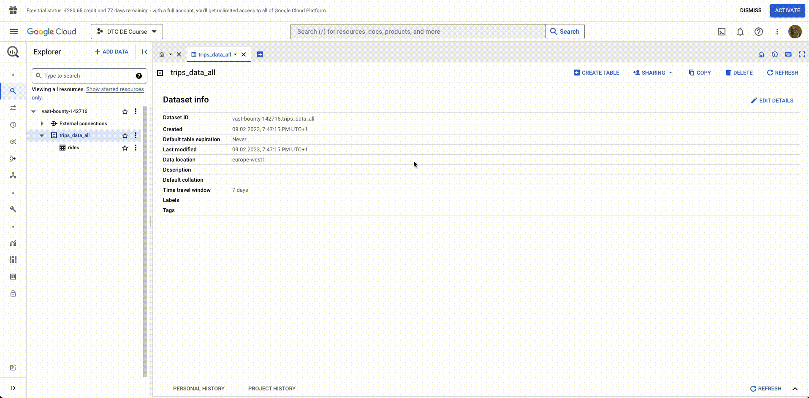

# ETL with GCP & Prefect

## Introduction

We are going to create an ETL pipeline to automatically ingest our data into Google Cloud Storage.

We need to already have the __infrastructure up__ to perform the operations.

## GCS Bucket

We start the prefect UI with `prefect orion start`. Here, we can create a `GCS Bucket` block. before we create we register the kind of block by:
```properties
prefect block register -m prefect_gcp
```

### GCP credentials block

To use the service account we generated in *week_1* we can use a `GCP Credentials Block` to store the credential info.



### CGS Bucket block

We can put the credentials block we just created in a GCS Bucket block:



### Coding the pipeline

Now we can put these blocks into our code! We will refactor the pipeline to use these classes. Right now we arent transforming the data after ingestion, but in the future we can add functions before the loading!

??? Example
    ```python
    from datetime import timedelta
    from pathlib import Path

    import pandas as pd
    from prefect import flow, task
    from prefect.tasks import task_input_hash
    from prefect_gcp.cloud_storage import GcsBucket


    @flow()
    def etl_web_to_gcs() -> None:
        """Main ETL Function"""
        COLOR = "yellow"
        YEAR = 2022
        MONTH = 1

        dataset_file = f"{COLOR}_tripdata_{YEAR}-{MONTH:02}.parquet"
        dataset_url = f"https://d37ci6vzurychx.cloudfront.net/trip-data/{dataset_file}"

        dataset = get_data(dataset_url)
        data_file_path = write_local(df=dataset, color=COLOR, dataset_file=dataset_file)
        write_gcs(path=data_file_path)


    @task(cache_key_fn=task_input_hash, cache_expiration=timedelta(weeks=1))
    def get_data(url: str) -> pd.DataFrame:
        data = pd.read_parquet(url)
        return data


    @task()
    def write_local(df: pd.DataFrame, color: str, dataset_file: str) -> Path:
        """Write DataFrame out locally as parquet file"""
        path = Path(f"data/{color}/{dataset_file}")
        path.parent.mkdir(parents=True, exist_ok=True)
        df.to_parquet(path, compression="gzip")
        return path


    @task
    def write_gcs(path: Path) -> None:
        """Upload local parquet file to GCS"""
        gcs_block = GcsBucket.load("dte-bucket-block")
        gcs_block.upload_from_path(from_path=path, to_path=path)


    if __name__ == "__main__":
        etl_web_to_gcs()
    ```

## GCS to BigQuery

Weve got the data in its raw form on a Bucket, we are going to add it to our BigQuery Database. Since we are simulating a usecase, we are going to download the data from GCS even if it is already in our system from the previous step.

We created the `trips_data_all` _dataset_ using [_terraform_](https://github.com/Tonivalle/DTC-DE-Course/blob/main/code/week_1/terraform/main.tf) but if you dont have one, create one using terraform or the UI.

We can load the data to __BigQuery__ following this example:
??? Example
    ```python hl_lines="49 50 51 52 53 54 55"
    from pathlib import Path

    import pandas as pd
    from prefect import flow, task
    from prefect_gcp import GcpCredentials
    from prefect_gcp.cloud_storage import GcsBucket


    @flow()
    def etl_gcs_to_bq():
        """Main ETL flow to load data into Big Query"""
        COLOR = "yellow"
        YEAR = 2022
        MONTH = 1

        path = extract_from_gcs(COLOR, YEAR, MONTH)
        df = transform_data(path)
        write_to_bq(df)


    @task(retries=3)
    def extract_from_gcs(color: str, year: int, month: int) -> Path:
        """Extract data from GCS"""
        dataset_file = f"{color}_tripdata_{year}-{month:02}.parquet"
        gcs_path = Path(f"data/{color}/{dataset_file}")

        local_data_path = Path(__file__).parents[3]
        gcs_block = GcsBucket.load("dte-bucket-block")
        gcs_block.get_directory(from_path=gcs_path, local_path=local_data_path)
        return local_data_path / "data" / color / dataset_file


    @task(log_prints=True)
    def transform_data(path: Path) -> pd.DataFrame:
        """Data cleaning example"""
        df = pd.read_parquet(path)
        print(f"pre: missing passenger count: {df['passenger_count'].isna().sum()}")
        df["passenger_count"].fillna(0, inplace=True)
        print(f"post: missing passenger count: {df['passenger_count'].isna().sum()}")
        return df


    @task
    def write_to_bq(df: pd.DataFrame) -> None:
        """Write DataFrame to BiqQuery"""

        gcp_credentials_block = GcpCredentials.load("dte-gcp-credential")

        df.to_gbq(
            destination_table="trips_data_all.rides",
            project_id="vast-bounty-142716",
            credentials=gcp_credentials_block.get_credentials_from_service_account(),
            chunksize=500_000,
            if_exists="append",
        )


    if __name__ == "__main__":
        etl_gcs_to_bq()

    ```


Additionally, you can add data from GCS to BigQuery directly through the UI:


