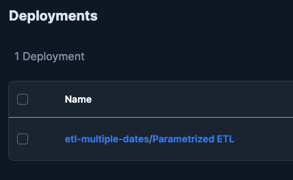
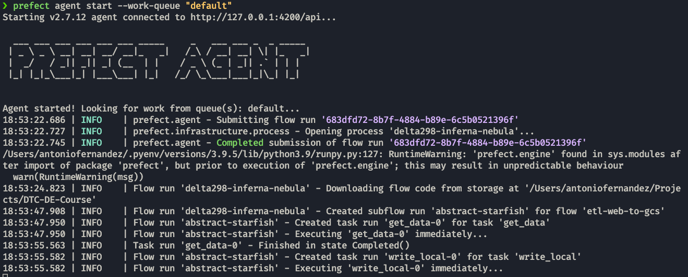
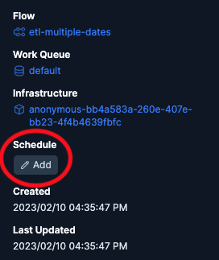
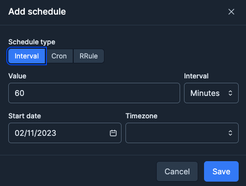

# Deployments

## Parametrizing Flow & Deployments

Instead of hard-coding the parameters for our workflow, we can add these as arguments to our _flows_. This way we can have different _runs_ that result in different data passing through the ETL pipeline.

??? Example
    ```python hl_lines="10 11 12 13 14 15 19"
    from datetime import timedelta
    from pathlib import Path

    import pandas as pd
    from prefect import flow, task
    from prefect.tasks import task_input_hash
    from prefect_gcp.cloud_storage import GcsBucket


    @flow
    def etl_multiple_dates(
        months: list[int] = [1, 2], year: int = 2022, color: str = "yellow"
    ):
        for month in months:
            etl_web_to_gcs(month=month, year=year, color=color)


    @flow()
    def etl_web_to_gcs(month: int, year: int, color: str) -> None:
        """Main ETL Function"""
        dataset_file = f"{color}_tripdata_{year}-{month:02}.parquet"
        dataset_url = f"https://d37ci6vzurychx.cloudfront.net/trip-data/{dataset_file}"

        dataset = get_data(dataset_url)
        data_file_path = write_local(df=dataset, color=color, dataset_file=dataset_file)  # type: ignore
        write_gcs(path=data_file_path)


    @task(retries=3, cache_key_fn=task_input_hash, cache_expiration=timedelta(weeks=1))
    def get_data(url: str) -> pd.DataFrame:
        data = pd.read_parquet(url)
        return data


    @task()
    def write_local(df: pd.DataFrame, color: str, dataset_file: str) -> Path:
        """Write DataFrame out locally as parquet file"""
        path = Path(f"data/{color}/{dataset_file}")
        path.parent.mkdir(parents=True, exist_ok=True)
        df.to_parquet(path, compression="gzip")
        return path


    @task
    def write_gcs(path: Path) -> None:
        """Upload local parquet file to GCS"""
        gcs_block = GcsBucket.load("dte-bucket-block")
        gcs_block.upload_from_path(from_path=path, to_path=path)


    if __name__ == "__main__":
        etl_multiple_dates()
    ```

### Deployments

A __deployment__ allows us to trigger and schedule our _flow runs_ via the API.

A __deployment definition__ is composed by packaging workflow code, settings, and infrastructure configuration so that the workflow can be managed via the Prefect API and run remotely by a Prefect agent.

Multiple deployments can be created for a single flow, with different parameters, infrastructures, schedules... The full list of options can be found in the [docs](https://docs.prefect.io/concepts/deployments/#deployment-build-options).

For example, for our flows we can have:

```properties
prefect deployment build ./src/dtc_de_course/week_2/p03_param_flow/parametrized_flow.py:etl_multiple_dates -n "Parametrized ETL" -o ./src/dtc_de_course/week_2/p03_param_flow/parametrized_flow.yaml
```
In this example we see that we can specify the flow that we are going to deploy using `:` after the file to specify.
We also gave it the name _Parametrized ETL_ using `-n` and the output location with `-o`.

This file contains all the necessary data for the _orchestrator_ to handle this deployment.

We can also pass parameters to the flow without having to use _argparse_ to format them using the `--params` argument:

```properties
prefect deployment build ./src/dtc_de_course/week_2/p03_param_flow/parametrized_flow.py:etl_multiple_dates \
-n "Parametrized ETL" -o ./src/dtc_de_course/week_2/p03_param_flow/parametrized_flow.yaml \
--params='{"months": [3,4,5]}'
```

To send this data to the prefect API, we use the command:
```properties
prefect deployment apply ./src/dtc_de_course/week_2/p03_param_flow/parametrized_flow.yaml
```
Now this deployment is visible on the `Deployments` tab inside UI.



In there we can edit its description, tags, parameters... like we could with the command. We can also do a _custom run_ clicking on the 3 dots, in which we can pass different parameters from the deployment's usual ones.

### Work queues and agents

An __agent__ is a very lighweight python process that lives in your execution environment (local, container, server...).

Those __agents__ pick their tasks from a __work queue__, that contains a list of deployments to run. You can have multiple work queues as well and change which one a deployment will run so you can have work queues from different environments.

To activate an agent with a specific work queue we can do:
```properties
prefect agent start --work-queue "default"
```



## Scheduling 

Clicking on a deployment, on the right side, you can see that there is an option to schedule. For this schedule to happen there needs to be an __Agent__ that picks it up from its __work queue__.

{width=38%} {width=59%}

!!! tip
    You can also add the schedule when creating a deployment by using `--cron`, `--interval` or `--rrule`. To get a schedule of 1 minute you can do: --cron "*/1 * * * *" / --interval 60 / --rrule 'FREQ=MINUTELY'
    
    * __Cron__ is most appropriate for users who are already familiar with cron from previous use.

    * __Interval__ is best suited for deployments that need to run at some consistent cadence that isn't related to absolute time.

    * __RRule__ is best suited for deployments that rely on calendar logic for simple recurring schedules, irregular intervals, exclusions, or day-of-month adjustments.