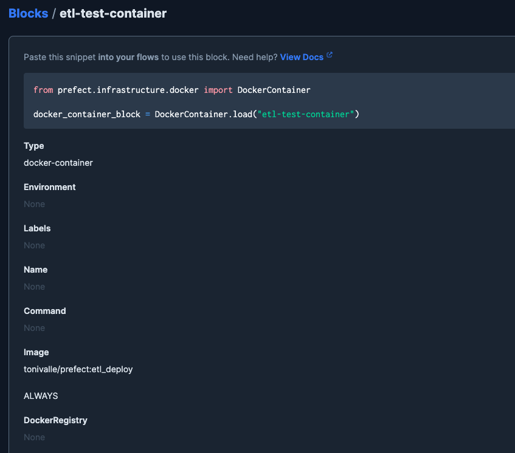

# Prefect + Docker

## Running a Flow in a Docker Container

To have the system be more production-ready and allow other people to access our code, we can put it on cloud storage or run it using a __Docker image__, with the code included in it.

By default, prefect will look for flows inside the `/opt/prefect/flows` folder.

We create these two files:

=== "Dockerfile"

    ```Dockerfile
    FROM prefecthq/prefect:2.7.7-python3.9

    COPY docker-requirements.txt .

    RUN pip install -r docker-requirements.txt --trusted-host pypi.python.org --no-cache-dir

    COPY ../flows /opt/prefect/flows 

    RUN mkdir -p /opt/prefect/data/yellow
    ```

=== "docker-requirements.txt"
    ```python
    pandas==1.5.2
    prefect-gcp[cloud_storage]==0.2.4
    protobuf==4.21.11
    pyarrow==10.0.1
    pandas-gbq==0.18.1
    ```

And now we can build the image as usual by executing:
```properties
docker build -t tonivalle/prefect:etl_deploy ./src/dtc_de_course/week_2/p04_prefect_and_docker
```

To push this image to Docker hub we have to do:

```properties
# First we login on docker
docker login

# Now we push the image
docker image push tonivalle/prefect:etl_deploy
```

### Adding the Docker Block

On the UI we will need to create a __Docker Block__ that references our image.



!!! tip
    Alternatively, you can create this block via [code](https://github.com/discdiver/prefect-zoomcamp/tree/main/blocks):
    ```python
    from prefect.infrastructure.docker import DockerContainer

    # alternative to creating DockerContainer block in the UI
    docker_block = DockerContainer(
        image="tonivalle/prefect:etl_deploy",  # insert your image here
        image_pull_policy="ALWAYS",
        auto_remove=True,
    )

    docker_block.save("etl-test-container", overwrite=True)
    ```

We can now create a deployment using this block. Before we did it via the CLI, but we can also do it using Python code:
```python
from prefect.deployments import Deployment
from prefect.infrastructure.docker import DockerContainer
from parametrized_flow import etl_multiple_dates

docker_block = DockerContainer.load("etl-test-container")

docker_deployment = Deployment.build_from_flow(
    flow=etl_multiple_dates,
    name="docker-etl-flow",
    infrastructure=docker_block
)

if __name__ == "__main__":
    docker_deployment.apply()
``` 
And calling ( It's important to do it from the folder that contains this file):
```properties
python docker_deploy.py
```

We should be able to see this new deployment inside our UI.

### Prefect profile

Typing:
```properties
❯ prefect profile ls
    ┏━━━━━━━━━━━━━━━━━━━━━┓
    ┃ Available Profiles: ┃
    ┡━━━━━━━━━━━━━━━━━━━━━┩
    │           * default │
    └─────────────────────┘
```
We can see the available profiles. We are going to activate an agent to look for work in the default queue:
```
❯ prefect agent start -q default

    Starting v2.8.0 agent connected to http://127.0.0.1:4200/api...

    ___ ___ ___ ___ ___ ___ _____     _   ___ ___ _  _ _____
    | _ \ _ \ __| __| __/ __|_   _|   /_\ / __| __| \| |_   _|
    |  _/   / _|| _|| _| (__  | |    / _ \ (_ | _|| .` | | |
    |_| |_|_\___|_| |___\___| |_|   /_/ \_\___|___|_|\_| |_|


    Agent started! Looking for work from queue(s): default...
```
Running the deployment will put it on the queue of the flow (in this case `default`):
```
❯ prefect deployment run etl-multiple-dates/docker-etl-flow -p "months=[1,2]"
    Creating flow run for deployment 'etl-multiple-dates/docker-etl-flow'...
    Created flow run 'thistle-ocelot'.
    └── UUID: f05a5c41-2e7f-4d59-ad27-5e25d10cacbf
    └── Parameters: {'months': [1, 2]}
    └── Scheduled start time: 2023-02-11 14:35:34 CET (now)
    └── URL: http://127.0.0.1:4200/flow-runs/flow-run/f05a5c41-2e7f-4d59-ad27-5e25d10cacbf
```
!!! warning
    You need to `cd` into this directory when creating the deployment and possibly the image; doing it from the ouside will mess imports if they dont have the same structure!