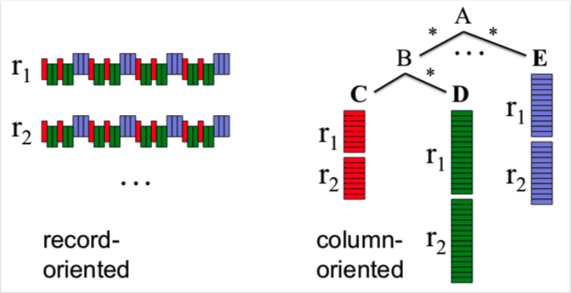
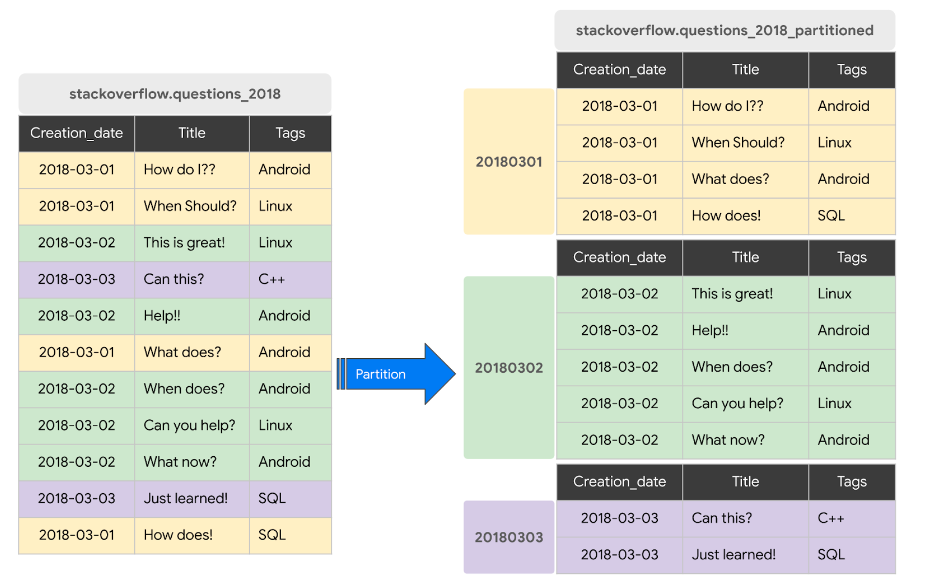

# Data warehouse & Big Query
## OLAP vs OLTP

An __OLAP__ system is designed to process large amounts of data quickly, allowing users to analyze multiple data dimensions in tandem. Teams can use this data for decision-making and problem-solving and users are usually data scientists/analysts. 

In contrast, __OLTP__ systems are designed to handle large volumes of transactional data involving multiple users, in fast but small transactions.

|| OLAP  | OLTP |
|:---------------: | :---------------: | :--------------------------------------------: |
| __Meaning__ | On-Line Analytical Process | On-Line Transaction Processing | 
| __Purpose__ | Plan, solve problems, support decisions, discover hidden insights | Control and run essential business operations in real time | 
|__Data updates__|Data periodically refreshed with scheduled, long-running batch jobs|Short, fast updates initiated by user|
|__Database design__|Denormalized databases for analysis|Normalized databases for efficiency|
|__Space requirements__|Generally large due to aggregating large datasets|Generally small if historical data is archived|
|__Backup and recovery__|Lost data can be reloaded from OLTP database as needed in lieu of regular backups|Regular backups required to ensure business continuity and meet legal and governance requirements|
|__Productivity__|Increases productivity of business managers, data analysts, and executives|Increases productivity of end users|
|__Data view__|Multi-dimensional view of enterprise data|Lists day-to-day business transactions|
|__User examples__|Knowledge workers such as data analysts, business analysts, and executives|Customer-facing personnel, clerks, online shoppers|

## Data warehouses

A data warehouse is a __OLAP__ solution, used primarily for data analysis and reporting. They contain __Meta Data__, __Raw Data__ and __Summary Data__. This data comes from many different sources, that report to a staging area that is the one that writes to the warehouse.

A warehouse can be divided in __Data Marts__, which are a data storage system that contains information specific to an organization's business unit, like sales, supply chain, HR, marketing...

Data mats are usually used as interfaces for users but sometimes data warehouses are used by analysts for broader insights


## Big Query

Big query is a __Serverless Data Warehouse__ (you dont have to manage a server or install software to make it work) that includes software and infrastructure from the get-go. It has built-in features for machine learning, geospatial analysis or BI, and maximizes flexibility by separating your storage and the computer engine that processes your data.

Big query contains also public datasets like `bigquery-public-data.new_york_citibike.citibike_stations` which you can search using the _explorer search bar_ and _broadening search to all projects_.

It is a column oriented storage (instead of record oriented like `csv` files or databases like `Postgres`/`MySQL`) which helps provide better aggregation on columns, which is a more used operation type for analysis.



### Creating an external table

You can create a table that is not stored on Big Query (an __external table__) by using:
```sql
CREATE OR REPLACE EXTERNAL TABLE `vast-bounty-142716.trips_data_all.external_yellow_tripdata`
OPTIONS (
  format = 'parquet',
  uris = ['gs://dtc-de-data-lake/data/yellow/yellow_tripdata_2022-*.parquet']
);
```
!!! note
    When creating external tables, Big Query will not be able to get the table size or the number of rows if you go to table information since it is not actually stored on the warehouse.

### Partitions

We can create __partitions__ by splitting the data using one or more columns. 

There is a limit of 4000 partitions per table.
```sql
CREATE OR REPLACE TABLE vast-bounty-142716.trips_data_all.yellow_tripdata_partitoned
PARTITION BY
  DATE(tpep_pickup_datetime) AS
SELECT * FROM vast-bounty-142716.trips_data_all.external_yellow_tripdata;
```


Partitions are a good idea in Cloud Computing since filtering using the partition column will need to process fewer data as it is already pre-filtered.
```sql
-- Impact of partition
-- Scanning 1.6GB of data
SELECT DISTINCT(VendorID)
FROM vast-bounty-142716.trips_data_all.yellow_tripdata_non_partitoned
WHERE DATE(tpep_pickup_datetime) BETWEEN '2022-06-01' AND '2022-06-30';

-- Scanning ~106 MB of DATA
SELECT DISTINCT(VendorID)
FROM vast-bounty-142716.trips_data_all.yellow_tripdata_partitoned
WHERE DATE(tpep_pickup_datetime) BETWEEN '2022-06-01' AND '2022-06-30';
```

We can look at the partitions and their size:
```sql
SELECT table_name, partition_id, total_rows
FROM `nytaxi.INFORMATION_SCHEMA.PARTITIONS`
WHERE table_name = 'yellow_tripdata_partitoned'
ORDER BY total_rows DESC;
```

Go to [Google Docs for this feature](https://cloud.google.com/bigquery/docs/partitioned-tables).

### Clusters
Clustering allows you to group data (it works inside partitions). 

This benefits us in two ways: the rows that share tha same cluster will be grouped when we see the table and the cost and performance will improve. Filter queries and aggregate queries will also show better performance, especially with tables > 1GB of data. 

The order of the columns when generating the clusters is important, since that will be the way the rows will be ordered after the operation.

The limit is of 4 clustering columns per table.


```sql
CREATE OR REPLACE TABLE vast-bounty-142716.trips_data_all.yellow_tripdata_partitoned_clustered
PARTITION BY DATE(tpep_pickup_datetime)
CLUSTER BY VendorID AS
SELECT * FROM vast-bounty-142716.trips_data_all.external_yellow_tripdata;

-- Processing partitioned & clustered data
-- Query scans 1.1 GB
SELECT count(*) as trips
FROM vast-bounty-142716.trips_data_all.yellow_tripdata_partitoned
WHERE DATE(tpep_pickup_datetime) BETWEEN '2022-06-01' AND '2023-12-31'
  AND VendorID=1;

-- Query scans 864.5 MB
SELECT count(*) as trips
FROM vast-bounty-142716.trips_data_all.yellow_tripdata_partitoned_clustered
WHERE DATE(tpep_pickup_datetime) BETWEEN '2022-06-01' AND '2023-12-31'
  AND VendorID=1;
```

Go to [Google Docs for this feature](https://cloud.google.com/bigquery/docs/clustered-tables).

### Cluster vs. Partition

| Clustering | Partitoning |
|---|---|
| Cost benefit unknown | Cost known upfront |
| You need more granularity than partitioning alone allows | You need partition-level management. |
| Your queries commonly use filters or aggregation against multiple particular columns | Filter or aggregate on single column |
| The cardinality of the number of values in a column or group of columns is large |   |

You should choose Clustering over Partitioning if:

* Partitioning results in a small amount of data per partition (approximately less than 1 GB). When your granularity is high, its better to Cluster.
* Partitioning results in a large number of partitions beyond the limits on partitioned tables (4000 partitions).
* Partitioning results in your mutation operations modifying the majority of partitions in the table frequently (for example, every few minutes).

### Automatic reclustering
As data is added to a clustered table, the new data is organized into blocks, which might create new storage blocks or update existing blocks. Block optimization is required for optimal query and storage performance because new data might not be grouped with existing data that has the same cluster values.

To maintain the performance characteristics of a clustered table:

* BigQuery performs automatic re-clustering in the background.
* For partitioned tables, clustering is maintained for data within the scope of each partition.

### Best practices on Big Query
* Cost reduction
    * Avoid SELECT *
    * Price your queries before running them (You can see this on the top right)
    * Use clustered or partitioned tables
    * Use streaming inserts with caution
    * Materialize query results in stages


* Query Performance
    * Filter on partitioned columns
    * Denormalizing data
        * Use nested or repeated columns
    * Use external data sources appropriately (They may incur more cost)
        * Don't use it if you want high query performance
    * Reduce data before using a JOIN
    * Do not treat WITH clauses as prepared statements
    * Avoid oversharding tables
    * Avoid JavaScript user-defined functions
    * Use approximate aggregation functions (HyperLogLog++)
    * `Order` should be the last part of the query, for query operations to maximize performance
    * Optimize your join patterns
        * As a best practice, place the table with the largest number of rows first, followed by the table with the fewest rows, and then place the remaining tables by decreasing size.


## Other notes
All the queries can be found on [here](https://github.com/Tonivalle/DTC-DE-Course/tree/main/src/dtc_de_course/week_3/big_query_sample_queries.sql).