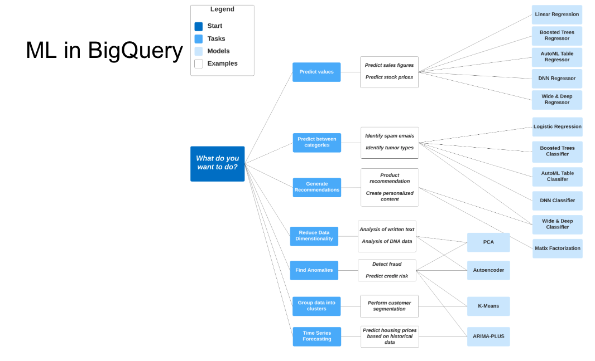

# ML in BigQuery
## Introduction
The target for ML in BigQuery is Data Analysts or managers, as you dont need programming knowledge or to export the data to different systems.

ML in BigQuery is free for:

* 10 GB per month of data storage
* 1 TB per month of queries processed
* while usingML Create model step: First 10 GB per month is free

Then it can go for ~250$ per TB for most models.



The way to create a model is the following:

```sql hl_lines="18"
-- CREATE A ML TABLE WITH APPROPRIATE TYPE
CREATE OR REPLACE TABLE `vast-bounty-142716.trips_data_all.yellow_tripdata_ml` (
`passenger_count` INTEGER,
`trip_distance` FLOAT64,
`PULocationID` STRING,
`DOLocationID` STRING,
`payment_type` STRING,
`fare_amount` FLOAT64,
`tolls_amount` FLOAT64,
`tip_amount` FLOAT64
) AS (
SELECT passenger_count, trip_distance, cast(PULocationID AS STRING), CAST(DOLocationID AS STRING),
CAST(payment_type AS STRING), fare_amount, tolls_amount, tip_amount
FROM `vast-bounty-142716.trips_data_all.yellow_tripdata_partitoned` WHERE fare_amount != 0
);

-- CREATE MODEL WITH DEFAULT SETTING
CREATE OR REPLACE MODEL `vast-bounty-142716.trips_data_all.tip_model`
OPTIONS
(model_type='linear_reg',
input_label_cols=['tip_amount'],
DATA_SPLIT_METHOD='AUTO_SPLIT') AS
SELECT
*
FROM
`vast-bounty-142716.trips_data_all.yellow_tripdata_ml`
WHERE
tip_amount IS NOT NULL;
```
You can then explain and predict by using:

```sql
SELECT
*
FROM
ML.EXPLAIN_PREDICT(MODEL `vast-bounty-142716.trips_data_all.tip_model`,
(
SELECT
*
FROM
`vast-bounty-142716.trips_data_all.yellow_tripdata_ml`
WHERE
tip_amount IS NOT NULL
), STRUCT(3 as top_k_features));
```

Google has a [site](https://cloud.google.com/bigquery-ml/docs/tutorials) for their tutorials on this.

### Feature Preprocessing

There are two ways to do feature preprocessing: Automatic and Manual.

[__Automatic feature preprocessing__](https://cloud.google.com/bigquery-ml/docs/reference/standard-sql/bigqueryml-auto-preprocessing) offers Missing Data Imputation, Feature Transformations and Categorical Feature Encoding.

[__Manual feature preprocessing__](https://cloud.google.com/bigquery-ml/docs/reference/standard-sql/bigqueryml-preprocessing-functions) offers  `ML.BUCKETIZE`, `ML.POLYNOMIAL_EXPAND`, `ML.FEATURE_CROSS`, `ML.NGRAMS`, `ML.QUANTILE_BUCKETIZE`, `ML.HASH_BUCKETIZE`, `ML.MIN_MAX_SCALER`, `ML.STANDARD_SCALER`, `ML.MAX_ABS_SCALER`, `ML.ROBUST_SCALER`, `ML.NORMALIZER`, `ML.IMPUTER`, `ML.ONE_HOT_ENCODER`, `ML.LABEL_ENCODER`,

### Hyperparameter tuning

You can also performe hyperparameter tuning on created models:

```sql
-- HYPER PARAM TUNNING
CREATE OR REPLACE MODEL `vast-bounty-142716.trips_data_all.tip_hyperparam_model`
OPTIONS
(model_type='linear_reg',
input_label_cols=['tip_amount'],
DATA_SPLIT_METHOD='AUTO_SPLIT',
num_trials=5,
max_parallel_trials=2,
l1_reg=hparam_range(0, 20),
l2_reg=hparam_candidates([0, 0.1, 1, 10])) AS
SELECT
*
FROM
`vast-bounty-142716.trips_data_all.yellow_tripdata_ml`
WHERE
tip_amount IS NOT NULL;
```