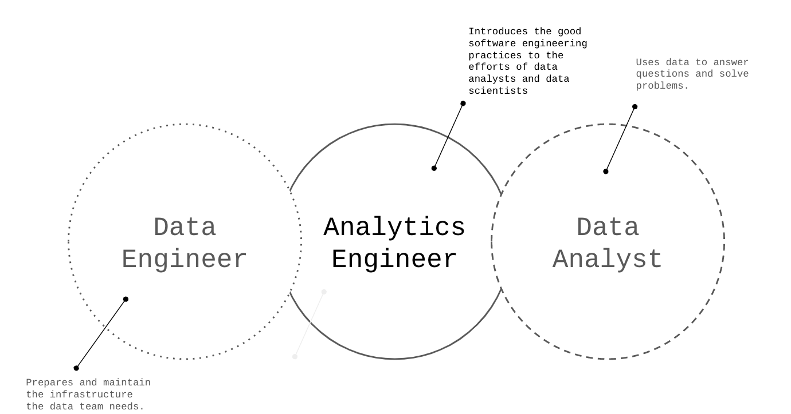

# Analytics engineering
## What is Analytics engineering?
Analytics engineering is the bridge between Data engineers and analysts.

Their usual competences are in __Data Loading__ (see [ETL vs ELT](https://github.com/Tonivalle/DTC-DE-Course/blob/main/docs/week_2/1-data-lake.md#etl-vs-elt)), __Data Storing__ (using data warehouses and lakes), __Data Modeling__ (using tools like dbt or Dataform) and __Data Presentation__ (with Google Data Studio, Tableau, PowerBI...).

## Dimensional Modeling

Kimball’s Dimensional Modeling has the objective of delivering data understandable to the business users and fast query performance. This is done by prioritising user understandability and query performance over non redundant data (3NF).

Other approaches are [Bill Inmon](https://ia800202.us.archive.org/9/items/2005BuildingTheDataWarehouse4thEditionWilliamH.Inmon/2005%20-%20Building%20The%20Data%20Warehouse%20%284th%20Edition%29%20%28William%20H.%20Inmon%29.pdf) and [Data vault](https://en.wikipedia.org/wiki/Data_vault_modeling).

Dimensional Modeling is composed of 2 principal elements: Facts tables and Dimensions tables.

* Facts tables are composed of __measurements, metrics or facts__ which corresponds to a business process (sales, orders...).
* Dimensions tables correspond to __business entities__ and provide context to a business process (meaning they provide context to a Fact table by extension). They can be customers, product...

### Architecture of Dimensional Modeling

It is composed of 3 areas:

1. __Stage Area__
    * Contains the raw data.
    * Only accessible to people that know how to use/transform raw data.

2. __Processing Area__
    * Transforms from raw data to data models.
    * Focused on efficiency and ensuring standards.
    * Only accessible to people who transform the raw data or use the data models with few transformations.

3. __Presentation Area__
    * Final form of the data.
    * Accessible by business stakeholders.

More information about Dimensional Modeling can be found [here](http://www.kimballgroup.com/wp-content/uploads/2013/08/2013.09-Kimball-Dimensional-Modeling-Techniques11.pdf).