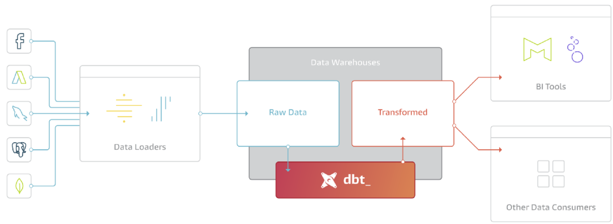

# dbt basics

## What is dbt

It stands for Data Build Tool and is a open-source transformation tool that allows anyone that knows SQL to deploy analytics code following software engineering best practices like modularity, portability, CI/CD, version controll, and documentation. 

Dbt Core is free for all use, but there is also dbt Cloud that adds functionality and is free only for individuals.

It is used inside the data warehouse, so it is part of a ELT process inside a warehouse.



It works by adding a __modeling layer__ that turns a table into a model, transforms the model into a derived model, and then persists the model back to the warehouse.

Each model is a .sql file (that is basically a `select` statement that will compile later to a DDL/DML) that dbt will compile and run in our data warehouse.

We are going to use it by developing on BigQuery using dbt Cloud and on our local Postgres DDBB using a local installation of dbt, running the models via the CLI.

## Creating a new dbt project

Depending on the environment, we will use different ways to start the project:

### With the CLI
We need to [install dbt locally](https://docs.getdbt.com/docs/get-started/installation). For mac it is done via:
```properties
brew update
brew tap dbt-labs/dbt

# change this to your specific DB.
brew install dbt-postgres 
```
Now you set up `profiles.yml` depending on your DB from [this page]((https://docs.getdbt.com/reference/profiles.yml))'s table of contents on the left.


Run `dbt init` in the path we want to start the project to clone the starter project.


### With dbt Cloud and Big Query

You will need to create a dbt cloud account using [this link](https://www.getdbt.com/signup/) and connect to your warehouse following [these instructions](https://docs.getdbt.com/docs/dbt-cloud/cloud-configuring-dbt-cloud/cloud-setting-up-bigquery-oauth). More detailed instructions in [here](https://github.com/DataTalksClub/data-engineering-zoomcamp/blob/main/week_4_analytics_engineering/dbt_cloud_setup.md).

!!!note
    If you feel more comfortable developing locally you could use a local installation of dbt as well. You can follow the [official dbt documentation](https://docs.getdbt.com/dbt-cli/installation) or follow the [dbt with BigQuery on Docker guide](https://github.com/DataTalksClub/data-engineering-zoomcamp/blob/main/week_4_analytics_engineering/docker_setup/README.md) to setup dbt locally on docker. You will need to install the latest version (1.0) with the BigQuery adapter (dbt-bigquery).

After having set up the dbt cloud credentials (repo and data warehouse) we can start the project from the web-based IDE by clicking on `initialize your project`.

Once we do that we can go ahead and change the name of the project in the `dbt_project.yml` (It appears more than once later in the yml, change it everywhere).