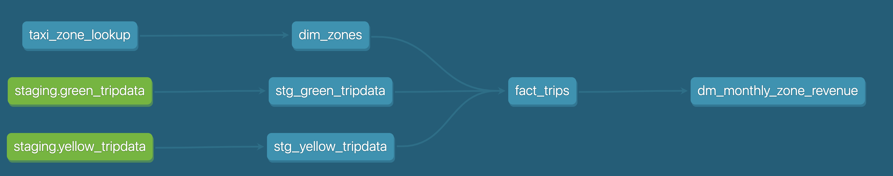

# Using dbt

Everything in this section will be expanded on a [dbt repository](https://github.com/Tonivalle/DTC-DE-dbt-training).

## Building the first models

We use Jinja inside our sql code to add __macros__ (functions). At the beggining of the model it is usual to write the config macro:
```jinja
{{
    config(materialized='table')
}}
```
The parameter we are using is __materialized__ which provides the model the strategy for materializing the data. Usual options are `Table`, `View`, `Incremental` or `Ephemeral` but you can provide a custom one. `Table`, for example will drop the table of the same name inside our schema (if it exists) and will write our new data.

The __FROM__ statement of a model can be programmed with a macro called __source__:
```sql
select *,
    row_number() over(partition by vendorid, lpep_pickup_datetime) as rn
  from {{ source('staging','green_tripdata') }}
```

Such sources can be defined in a yml file with all the configuration.

Other option to load in our data warehouse are __seeds__ which are CSV files stored in the repository, using the `ref` macro. Reccomended only for small datasets that don't change often. 

## Creating our environment

We will create a branch to start and, in there, we will add two folders inside `model`: `staging` (which will contain the raw data with som typecasting or variable renaming) and `core` (which will contain the models that will be visible to our stakeholders).

On staging, we will create a `schema.yml` that will contain the information about our dataset. Having everything parametrized like this means that if you change from BigQuery to Postgres, you can just change the `database` parameter and it will work.

```yaml
version: 2

sources:
  - name: staging
    database: vast-bounty-142716
    schema: trips_data_all

    tables:
      - name: rides
```
!!! remember
    In BigQuery, a database is called `dataset`. You can get that by going to bigquery, right clicking the schema, and creating a new query

In this yml you can add a `freshness` parameter that will throw an error if the latest data is older than the threshold.

We can now create a yellow trip data model by creating a new file in staging, which we will call `stg_yellow_tripdata.sql`:

```sql
{{ config(materialized='view') }}

select * from {{ source(staging, rides) }}

limit 100
```

We can run this a few different ways, but using the CLI built in dbt cloud we can use:
```properties
dbt run
```
This will run every model on our project.

The full models are on the [dbt repository](https://github.com/Tonivalle/DTC-DE-dbt-training). In there, we select specific variables and we do type casting for example.

## Macros
Macros use control structures (if-else, for...) in SQL. They use env variables in the dbt project for production deployment.

As they compile to an SQL query, you can operate on the results of a query to generate another query.

An example can be the `get_payment_type_description` macro, contained in `macros/get_payment_type_description.sql`:
```jinja
 {#
    This macro returns the description of the payment_type 
#}



    case {{ payment_type }}
        when 1 then 'Credit card'
        when 2 then 'Cash'
        when 3 then 'No charge'
        when 4 then 'Dispute'
        when 5 then 'Unknown'
        when 6 then 'Voided trip'
    end


```

and we can use it by using:
```SQL
{{ get_payment_type_description('payment_type') }} as payment_type_description
```
In the select part of the model.

## Importing packages

These are standalon dbt projects that you can import. By importing them you can use their models and macros.

They are defined in the `packages.yml` of your project and installed using `dbt deps`.

```yaml
packages:
  - package: dbt-labs/dbt_utils
    version: 0.8.0
```
A list of useful packages is in the [dbt package hub](https://hub.getdbt.com/).

## Variables

Variables in dbt are defined in the `dbt_project.yml` or passing them when running/building via the CLI.

=== "dbt_project.yml"

    ```yaml
    vars:
        payment_type_values: [1, 2, 3, 4, 5, 6]
    ```

=== "CLI"

    ```properties
    dbt run --m stg_yellow_tripdata --var 'is_test_run: false'
    ```

And on the model you can do:
```sql


  limit 100


```
Which will onli limit the number of rows if `is_test_run` is true. Note that with the `default` we can specify the behaviour if we dont have that variable or we dont pass it.

## Seeds
As was stated previously, __seeds__  are CSV files stored in the repository and they are reccomended only for small datasets that don't change often. 

To use them, we can add them in the `dbt_project.yml`. In this example we are going to add to the  `taxi_rides_ny` project the csv called `taxi_zone_lookup.csv`:

```yaml
seeds: 
    taxi_rides_ny:
        taxi_zone_lookup
```
You can cast types in the CSV when loading by doing:

```yaml
seeds: 
    taxi_rides_ny:
        taxi_zone_lookup:
            +column_types:
                locationid: numeric
```

## Joining models

If we had green taxi data as well in a model we can join them in another model that contains data from both.

!!! tip
    In this example, we join both tables, adding _"Green"_ or _"Yellow"_ as the `service_type` to differentiate between origins.

    We also added a seed containing the taxi zones (the same one as the section above) that will add information about the neighbourhoods and location info that will be joined at the end of the model.

```sql
{{ config(materialized='table') }}

with green_data as (
    select *, 
        'Green' as service_type 
    from {{ ref('stg_green_tripdata') }}
), 

yellow_data as (
    select *, 
        'Yellow' as service_type
    from {{ ref('stg_yellow_tripdata') }}
), 

trips_unioned as (
    select * from green_data
    union all
    select * from yellow_data
), 

dim_zones as (
    select * from {{ ref('dim_zones') }}
    where borough != 'Unknown'
)
select 
    trips_unioned.tripid, 
    trips_unioned.vendorid, 
    trips_unioned.service_type,
    trips_unioned.ratecodeid, 
    trips_unioned.pickup_locationid, 
    pickup_zone.borough as pickup_borough, 
    pickup_zone.zone as pickup_zone, 
    trips_unioned.dropoff_locationid,
    dropoff_zone.borough as dropoff_borough, 
    dropoff_zone.zone as dropoff_zone,  
    trips_unioned.pickup_datetime, 
    trips_unioned.dropoff_datetime, 
    trips_unioned.store_and_fwd_flag, 
    trips_unioned.passenger_count, 
    trips_unioned.trip_distance, 
    trips_unioned.trip_type, 
    trips_unioned.fare_amount, 
    trips_unioned.extra, 
    trips_unioned.mta_tax, 
    trips_unioned.tip_amount, 
    trips_unioned.tolls_amount, 
    trips_unioned.ehail_fee, 
    trips_unioned.improvement_surcharge, 
    trips_unioned.total_amount, 
    trips_unioned.payment_type, 
    trips_unioned.payment_type_description, 
    trips_unioned.congestion_surcharge
from trips_unioned
inner join dim_zones as pickup_zone
on trips_unioned.pickup_locationid = pickup_zone.locationid
inner join dim_zones as dropoff_zone
on trips_unioned.dropoff_locationid = dropoff_zone.locationid

```

The final result will look like this:


## Testing dbt models

Tests are essentially a SELECT query that returns the number od failing records. Dbt provides basic tests for Uniques, nulls, accepted values, foreign keys on other tables... but you can create your own tests.

They are defined on a column in a yml file inside a `/tests` folder.


More information on the [official documentation](https://docs.getdbt.com/docs/build/tests).

## Documenting dbt models

Dbt provides a way to generate documentation for your dbt project and render it as a website. 

The documentation for your project includes:

* Information about your project: 
    * Model code (both from the .sql file and compiled)
    * Model dependencies
    * Sources
    * Auto generated DAG from the ref and source macros
    * Descriptions (from .yml file) and tests 

* Information about your data warehouse (information_schema):
    * Column names and data types
    * Table stats like size and rows
    * dbt docs can also be hosted in dbt cloud

On the `schema.yml` file, we can add information about the models like so:
```yaml
version: 2

sources:
    - name: staging
      #For bigquery:
      #database: taxi-rides-ny-339813

      # For postgres:
      database: production

      schema: trips_data_all

      # loaded_at_field: record_loaded_at
      tables:
        - name: green_tripdata
        - name: yellow_tripdata
         # freshness:
           # error_after: {count: 6, period: hour}

models:
    - name: stg_green_tripdata
      description: >
        Trip made by green taxis, also known as boro taxis and street-hail liveries.
        Green taxis may respond to street hails,but only in the areas indicated in green on the
        map (i.e. above W 110 St/E 96th St in Manhattan and in the boroughs).
        The records were collected and provided to the NYC Taxi and Limousine Commission (TLC) by
        technology service providers. 
      columns:
          - name: tripid
            description: Primary key for this table, generated with a concatenation of vendorid+pickup_datetime
            tests:
                - unique:
                    severity: warn
                - not_null:
                    severity: warn
          - name: VendorID 
            description: > 
                A code indicating the TPEP provider that provided the record.
                1= Creative Mobile Technologies, LLC; 
                2= VeriFone Inc.
          - name: pickup_datetime 
            description: The date and time when the meter was engaged.
          - name: dropoff_datetime 
            description: The date and time when the meter was disengaged.
          - name: Passenger_count 
            description: The number of passengers in the vehicle. This is a driver-entered value.
          - name: Trip_distance 
            description: The elapsed trip distance in miles reported by the taximeter.
          - name: Pickup_locationid
            description: locationid where the meter was engaged.
            tests:
              - relationships:
                  to: ref('taxi_zone_lookup')
                  field: locationid
                  severity: warn
          - name: dropoff_locationid 
            description: locationid where the meter was engaged.
            tests:
              - relationships:
                  to: ref('taxi_zone_lookup')
                  field: locationid
          - name: RateCodeID 
            description: >
                The final rate code in effect at the end of the trip.
                  1= Standard rate
                  2=JFK
                  3=Newark
                  4=Nassau or Westchester
                  5=Negotiated fare
                  6=Group ride
          - name: Store_and_fwd_flag 
            description: > 
              This flag indicates whether the trip record was held in vehicle
              memory before sending to the vendor, aka “store and forward,”
              because the vehicle did not have a connection to the server.
                Y= store and forward trip
                N= not a store and forward trip
          - name: Dropoff_longitude 
            description: Longitude where the meter was disengaged.
          - name: Dropoff_latitude 
            description: Latitude where the meter was disengaged.
          - name: Payment_type 
            description: >
              A numeric code signifying how the passenger paid for the trip.
            tests: 
              - accepted_values:
                  values: "{{ var('payment_type_values') }}"
                  severity: warn
                  quote: false
          - name: payment_type_description
            description: Description of the payment_type code
          - name: Fare_amount 
            description: > 
              The time-and-distance fare calculated by the meter.
              Extra Miscellaneous extras and surcharges. Currently, this only includes
              the $0.50 and $1 rush hour and overnight charges.
              MTA_tax $0.50 MTA tax that is automatically triggered based on the metered
              rate in use.
          - name: Improvement_surcharge 
            description: > 
              $0.30 improvement surcharge assessed trips at the flag drop. The
              improvement surcharge began being levied in 2015.
          - name: Tip_amount 
            description: > 
              Tip amount. This field is automatically populated for credit card
              tips. Cash tips are not included.
          - name: Tolls_amount 
            description: Total amount of all tolls paid in trip.
          - name: Total_amount 
            description: The total amount charged to passengers. Does not include cash tips.

    - name: stg_yellow_tripdata
      description: > 
        Trips made by New York City's iconic yellow taxis. 
        Yellow taxis are the only vehicles permitted to respond to a street hail from a passenger in all five
        boroughs. They may also be hailed using an e-hail app like Curb or Arro.
        The records were collected and provided to the NYC Taxi and Limousine Commission (TLC) by
        technology service providers. 
      columns:
          - name: tripid
            description: Primary key for this table, generated with a concatenation of vendorid+pickup_datetime
            tests:
                - unique:
                    severity: warn
                - not_null:
                    severity: warn
          - name: VendorID 
            description: > 
                A code indicating the TPEP provider that provided the record.
                1= Creative Mobile Technologies, LLC; 
                2= VeriFone Inc.
          - name: pickup_datetime 
            description: The date and time when the meter was engaged.
          - name: dropoff_datetime 
            description: The date and time when the meter was disengaged.
          - name: Passenger_count 
            description: The number of passengers in the vehicle. This is a driver-entered value.
          - name: Trip_distance 
            description: The elapsed trip distance in miles reported by the taximeter.
          - name: Pickup_locationid
            description: locationid where the meter was engaged.
            tests:
              - relationships:
                  to: ref('taxi_zone_lookup')
                  field: locationid
                  severity: warn
          - name: dropoff_locationid 
            description: locationid where the meter was engaged.
            tests:
              - relationships:
                  to: ref('taxi_zone_lookup')
                  field: locationid
                  severity: warn
          - name: RateCodeID 
            description: >
                The final rate code in effect at the end of the trip.
                  1= Standard rate
                  2=JFK
                  3=Newark
                  4=Nassau or Westchester
                  5=Negotiated fare
                  6=Group ride
          - name: Store_and_fwd_flag 
            description: > 
              This flag indicates whether the trip record was held in vehicle
              memory before sending to the vendor, aka “store and forward,”
              because the vehicle did not have a connection to the server.
                Y= store and forward trip
                N= not a store and forward trip
          - name: Dropoff_longitude 
            description: Longitude where the meter was disengaged.
          - name: Dropoff_latitude 
            description: Latitude where the meter was disengaged.
          - name: Payment_type 
            description: >
              A numeric code signifying how the passenger paid for the trip.
            tests: 
              - accepted_values:
                  values: "{{ var('payment_type_values') }}"
                  severity: warn
                  quote: false
          - name: payment_type_description
            description: Description of the payment_type code
          - name: Fare_amount 
            description: > 
              The time-and-distance fare calculated by the meter.
              Extra Miscellaneous extras and surcharges. Currently, this only includes
              the $0.50 and $1 rush hour and overnight charges.
              MTA_tax $0.50 MTA tax that is automatically triggered based on the metered
              rate in use.
          - name: Improvement_surcharge 
            description: > 
              $0.30 improvement surcharge assessed trips at the flag drop. The
              improvement surcharge began being levied in 2015.
          - name: Tip_amount 
            description: > 
              Tip amount. This field is automatically populated for credit card
              tips. Cash tips are not included.
          - name: Tolls_amount 
            description: Total amount of all tolls paid in trip.
          - name: Total_amount 
            description: The total amount charged to passengers. Does not include cash tips.
```