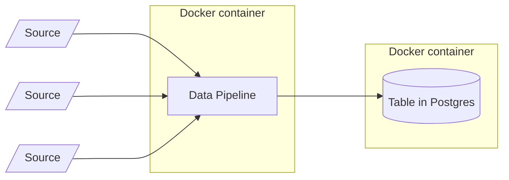
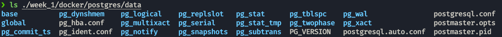
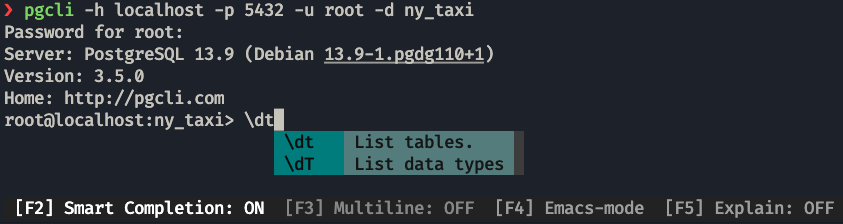
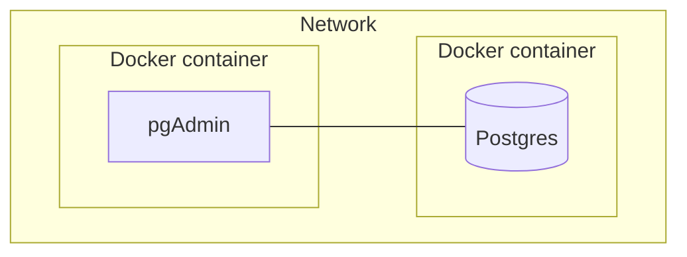
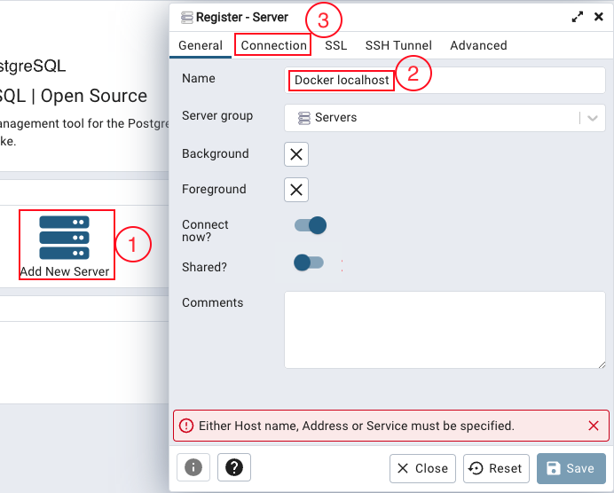
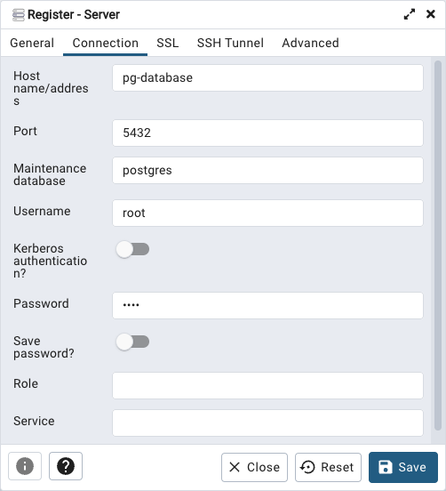

# Week 1: Introduction & Prerequisites

## 1. Sing up to Google Cloud
The Cloud provider used for this project will be Google Cloud.

https://console.cloud.google.com/getting-started

## 2. Install Google Cloud CLI
Follow the installation guide to install the CLI
https://cloud.google.com/sdk/docs/install

The CLI commands are [here](https://cloud.google.com/sdk/docs/cheatsheet).

## 3. Setup project

### Set up ADC (Application Default Credentials)
You need to set-up ADC for the environment you are going to use. To use your own account:
```properties
gcloud auth application-default login
```
Export the variable to the environment once you have logged in (The following path is the default for UNIX):
```bash
export GOOGLE_APPLICATION_CREDENTIALS="$HOME/.config/gcloud/application_default_credentials.json"
```
On this tutorial we will use a service account.

To create a service account, you have to got to:


In there, we create a new service account with **Storage Admin** + **Storage Object Admin** + **BigQuery Admin** permissions.

We generate a key for that account by clicking the 3 dots and adding a key.


Once it downloads, you can export it the same as your personal account and log in using that account.
```properties
export GOOGLE_APPLICATION_CREDENTIALS="<path/to/your/service-account-authkeys>.json"

gcloud auth activate-service-account --key-file "<path/to/your/service-account-authkeys>.json"
```
You should now see the account if you do:
```properties
gcloud auth list
```
and can now activate that account with:
```properties
gcloud config set account <accountemailaddress>
```

For more info you can check the [Tutorial](https://www.youtube.com/watch?v=UhYqag7Xjhw).

Enable these APIs for your project (by clicking on the links):

https://console.cloud.google.com/apis/library/iam.googleapis.com
https://console.cloud.google.com/apis/library/iamcredentials.googleapis.com
https://console.cloud.google.com/apis/library/bigquery.googleapis.com


Once we do that we can install python client libraries. e.g.:
```shell
poetry add google-cloud-storage
```
or 
```shell
pip install --upgrade google-cloud-storage
```


## 4. Install Terraform
Terraform is an open-source **infrastructure as code** software tool. It will be used to generate the GCP infrastructure.
```shell
brew tap hashicorp/tap
brew install hashicorp/tap/terraform
```
### Other options
https://developer.hashicorp.com/terraform/downloads

### Terraform GCP get started guide
https://developer.hashicorp.com/terraform/tutorials/gcp-get-started

## 5. Code your infrastructure with Terraform

### main.tf
This file contains these 4 basic declarations:
* `terraform`: configure basic Terraform settings to provision your infrastructure
   * `required_version`: minimum Terraform version to apply to your configuration
   * `backend`: stores Terraform's "state" snapshots, to map real-world resources to your configuration.
      * `local`: stores state file locally as `terraform.tfstate`
   * `required_providers`: specifies the providers required by the current module
* `provider`:
   * adds a set of resource types and/or data sources that Terraform can manage
   * The Terraform Registry is the main directory of publicly available providers from most major infrastructure platforms.
* `resource`
  * Physical component and its attributes.
  * blocks to define components of your infrastructure
  * Project modules/resources: google_storage_bucket, google_bigquery_dataset, google_bigquery_table

> **_NOTE:_** The resources change name with the different providers; in this case the required_providers source is `hashicorp/google` so we get `google_storage_bucket`for example. If it was `aws` we would have to use the `s3` version of the package.

### variables.tf

* `variable` & `locals` are runtime arguments and constants

They are used in the `main.tf` like so:

variables.tf
```terraform
variable "project" {
  description = "Your GCP Project ID"
}

variable "region" {
  description = "Region for GCP resources. Choose as per your location: https://cloud.google.com/about/locations"
  default = "europe-west6"
  type = string
}
```
main.tf:
```terraform
provider "google" {
  project = var.project
  region = var.region
}
```
## 6. Generate your infrastructure via Terraform
Terraform has few associated commands  that we need to use:
### Initialize state file (.tfstate)
```properties
terraform init
```

### Check changes to new infra plan
This command matches changes against the previous state.
```properties
terraform plan -var="project=<your-gcp-project-id>"
```
If you dont add the `-var` argument, You will get a promt like this one:\


### Create new infra
This command applies changes to the cloud.
```properties
terraform apply -var="project=<your-gcp-project-id>"
```
After a correct application, you can go to the management platform and see your newly created resources:


### Delete infra after your work, to avoid costs on any running services
```properties
terraform destroy
```

## 7. Docker 

We use docker to create the containers that will have the components for our application inside.


We will test the capabilities of docker in a local environment [here](./docker.md).


## 8. Postgres
To use postgres we are going to run an docker image that already contains it.

* We will use the `-e` tag to add environmental variables.
* The `-v` tag will map a folder in our host into a folder in the container; any modifications in one will happen on the other. **THIS FOLDER NEEDS TO BE EMPTY.**
* THe `-p` tag will map a port from the host to the container.

```bash
docker run -it \
  -e POSTGRES_USER="root" \
  -e POSTGRES_PASSWORD="root" \
  -e POSTGRES_DB="ny_taxi" \
  -v $(pwd)/week_1/docker/postgres/data:/var/lib/postgresql/data \
  -p 5432:5432 \
  postgres:13
```

> In this case, if you receive an error like `initdb: error: directory "/var/lib/postgresql/data" exists but is not empty.
If you want to create a new database system, either remove or empty the directory "/var/lib/postgresql/data" or run initdb with an argument other than "/var/lib/postgresql/data".`
The host folder you are providing is not empty.

This will create the folder structure needed for postgres.


To interface with the image we use `pgcli`, a python package that we will add to poetry.
```properties
poetry add "psycopg2-binary"
poetry add pgcli
```
Using the following command we can interface with the database:
```properties
pgcli -h localhost -p 5432 -u root -d ny_taxi
```
This allows us to use commands on the container.


We will add jupyter and other packages to our environment to explore the data.
```properties
poetry add jupyter pandas sqlalchemy
```

Now we will download the dataset, which is the NY taxi dataset, which is a common one for experimenting with data tools. The one used is [this one](https://d37ci6vzurychx.cloudfront.net/trip-data/yellow_tripdata_2022-01.parquet).

```properties
curl -O -L --output-dir ./week_1/docker/postgres/raw https://d37ci6vzurychx.cloudfront.net/trip-data/yellow_tripdata_2022-01.parquet
```
or
```properties
wget -p ./week_1/docker/postgres/raw https://d37ci6vzurychx.cloudfront.net/trip-data/yellow_tripdata_2022-01.parquet
```

We load this data into Postgres with the code inside [this notebook](./docker/postgres/data_to_postgres.ipynb).

To see the data and interact with it we are going to use pgAdmin inside a docker container.

```properties
docker run -it \
  -e PGADMIN_DEFAULT_EMAIL="admin@admin.com" \
  -e PGADMIN_DEFAULT_PASSWORD="root" \
  -p 8080:80 \
  dpage/pgadmin4
```

## 9.Networks
Right now the database and pgAdmin will not be able to see each other, we need to put them inside a common network. 


The code to create a network called `pg-network` is:

```properties
docker network create pg-network
```
and adding the network as environmental variable to the other two containers:

```properties
docker run -it \
  -e POSTGRES_USER="root" \
  -e POSTGRES_PASSWORD="root" \
  -e POSTGRES_DB="ny_taxi" \
  -v $(pwd)/week_1/docker/postgres/data:/var/lib/postgresql/data \
  -p 5432:5432 \
  --name pg-database \
  --network=pg-network \
  postgres:13

docker run -it \
  -e PGADMIN_DEFAULT_EMAIL="admin@admin.com" \
  -e PGADMIN_DEFAULT_PASSWORD="root" \
  -p 8080:80 \
  --network=pg-network \
  dpage/pgadmin4
```
> **_NOTE:_** We gave the database a `--name` to configure the connection easier, since if you dont you need to check the name docker has given the container.

We can now go to `localhost:8080` since in the pgadmin configuration we passed that as the port in our machine that will comunicate with the container.

We will need to login with the credentials `admin@admin.com` and `root` which we gave pgadmin as env variables.

Now clicking in `Add New Server`will show us the prompt to pass the database info, add a name and go to `Connection`.



Fill out the connection information with your containers data.


On the browser to the left we can check the data. Go to `Servers > Docker localhost > Databases > ny_taxi > Schemas > Tables` right click on it and select `First 100 Rows`.

You can also use SQL code via the `Query Tool`, accessible on the tools menu or clicking on this symbol: 

