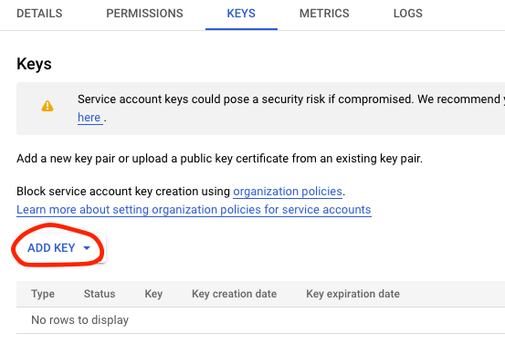
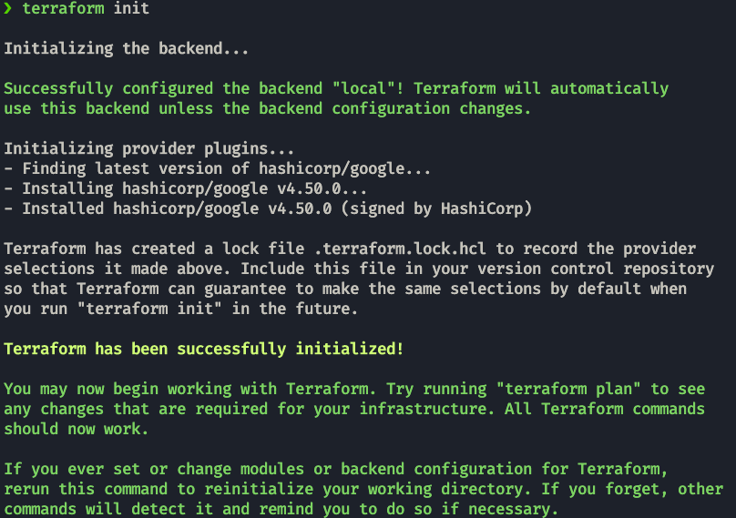
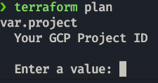
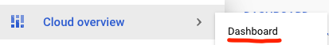
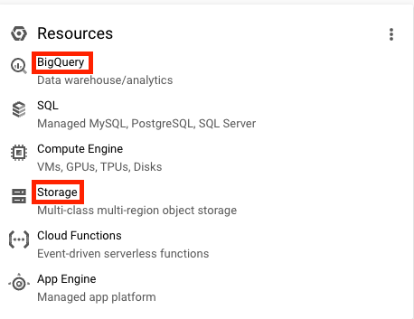

# Week 1: Introduction & Prerequisites

## 1. Sing up to Google Cloud
The Cloud provider used for this project will be Google Cloud.

https://console.cloud.google.com/getting-started

## 2. Install Google Cloud CLI
Follow the installation guide to install the CLI
https://cloud.google.com/sdk/docs/install

The CLI commands are [here](https://cloud.google.com/sdk/docs/cheatsheet).

## 3. Setup project

### Set up ADC (Application Default Credentials)
You need to set-up ADC for the environment you are going to use. To use your own account:
```
gcloud auth application-default login
```
Export the variable to the environment once you have logged in (The following path is the default for UNIX):
```bash
export GOOGLE_APPLICATION_CREDENTIALS="$HOME/.config/gcloud/application_default_credentials.json"
```
On this tutorial we will use a service account.

To create a service account, you have to got to:


In there, we create a new service account with **Storage Admin** + **Storage Object Admin** + **BigQuery Admin** permissions.

We generate a key for that account by clicking the 3 dots and adding a key.


Once it downloads, you can export it the same as your personal account and log in using that account.
```bash
export GOOGLE_APPLICATION_CREDENTIALS="<path/to/your/service-account-authkeys>.json"

gcloud auth activate-service-account --key-file "<path/to/your/service-account-authkeys>.json"
```
You should now see the account if you do:
```bash
gcloud auth list
```
and can now activate that account with:
```bash
gcloud config set account <accountemailaddress>
```

For more info you can check the [Tutorial](https://www.youtube.com/watch?v=UhYqag7Xjhw).

Enable these APIs for your project (by clicking on the links):

https://console.cloud.google.com/apis/library/iam.googleapis.com
https://console.cloud.google.com/apis/library/iamcredentials.googleapis.com
https://console.cloud.google.com/apis/library/bigquery.googleapis.com?project=vast-bounty-142716


Once we do that we can install python client libraries. e.g.:
```shell
poetry add google-cloud-storage
```
or 
```shell
pip install --upgrade google-cloud-storage
```


## 4. Install Terraform
Terraform is an open-source **infrastructure as code** software tool. It will be used to generate the GCP infrastructure.
```shell
brew tap hashicorp/tap
brew install hashicorp/tap/terraform
```
### Other options
https://developer.hashicorp.com/terraform/downloads

### Terraform GCP get started guide
https://developer.hashicorp.com/terraform/tutorials/gcp-get-started

## 5. Code your infrastructure with Terraform

## main.tf
This file contains these 4 basic declarations:
* `terraform`: configure basic Terraform settings to provision your infrastructure
   * `required_version`: minimum Terraform version to apply to your configuration
   * `backend`: stores Terraform's "state" snapshots, to map real-world resources to your configuration.
      * `local`: stores state file locally as `terraform.tfstate`
   * `required_providers`: specifies the providers required by the current module
* `provider`:
   * adds a set of resource types and/or data sources that Terraform can manage
   * The Terraform Registry is the main directory of publicly available providers from most major infrastructure platforms.
* `resource`
  * Physical component and its attributes.
  * blocks to define components of your infrastructure
  * Project modules/resources: google_storage_bucket, google_bigquery_dataset, google_bigquery_table

> **_NOTE:_** The resources change name with the different providers; in this case the required_providers source is `hashicorp/google` so we get `google_storage_bucket`for example. If it was `aws` we would have to use the `s3` version of the package.

## variables.tf

* `variable` & `locals` are runtime arguments and constants

They are used in the `main.tf` like so:

variables.tf
```terraform
variable "project" {
  description = "Your GCP Project ID"
}

variable "region" {
  description = "Region for GCP resources. Choose as per your location: https://cloud.google.com/about/locations"
  default = "europe-west6"
  type = string
}
```
main.tf:
```terraform
provider "google" {
  project = var.project
  region = var.region
}
```
## 6. Generate your infrastructure via Terraform
Terraform has few associated commands  that we need to use:
### Initialize state file (.tfstate)
```bash
terraform init
```

### Check changes to new infra plan
This command matches changes against the previous state.
```bash
terraform plan -var="project=<your-gcp-project-id>"
```
If you dont add the `-var` argument, You will get a promt like this one:\


### Create new infra
This command applies changes to the cloud.
```bash
terraform apply -var="project=<your-gcp-project-id>"
```
After a correct application, you can go to the management platform and see your newly created resources:


### Delete infra after your work, to avoid costs on any running services
```bash
terraform destroy
```